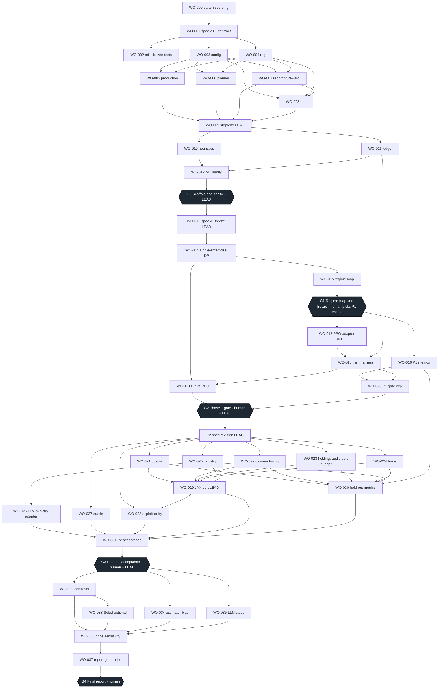

# ROADMAP

The order in which this repository gets built, and why that order.

This document is a map, not a specification. Where it summarises `PLAN.md`, the plan wins; where it
summarises `CONTRACT.md`, the contract wins. Every figure below is taken from `PLAN.md` or from a
work-order card in `workorders/`, and nothing here is a result.

Read alongside:

| File | What it gives you |
|---|---|
| [`README.md`](README.md) | orientation: what the environment is, what is and is not claimed |
| [`CONTRACT.md`](CONTRACT.md) | the 13 binding rules (PLAN section 9 verbatim) |
| `PLAN.md` | the authoritative build plan; git-ignored, supplied out of band, never committed |
| [`workorders/`](workorders/) | one card per unit of work, plus `TEMPLATE.md` and `AMBIGUITY_TEMPLATE.md` |

---

## 1. Framing

### 1.1 The two claims

The programme supports two claims that are stated, tested and reported **separately** (PLAN
section 1.1). No artefact may bear on both without saying which part is which.

**Claim A - emergence.** Under a fixed rule-based planner, learning enterprises rewarded only
through the five-term reward of PLAN section 2.9 produce (i) hidden reserves and report shaving,
(ii) input hoarding and propagated shortage, (iii) horizontal barter, and (iv) storming *in excess
of what input timing forces* - none of which is written into any transition rule or reward term
(CONTRACT rule 7).

Bunching, padding and quality degradation are **not** part of Claim A. They are direct optima of the
reward under agent control and serve as pipeline checks: if they fail to appear, the optimiser is
broken.

**Claim B - counterfactual.** For a pre-registered baseline configuration, the welfare gap to a
full-information oracle closed by an "OGAS" information contrast, by an incentive-reform contrast,
and by both together (with their interaction) is estimated with common random numbers and bootstrap
confidence intervals. Claim B is a set of **named contrasts** (C0, C_OGAS, C_AUDIT, C_INC, C_BOTH;
PLAN section 4.3), not a variance decomposition. A sentence of the form "X% of the welfare loss is
informational" appears in no output unless it is attached to a named contrast and a CI.

### 1.2 What each phase can establish

Reproduced from PLAN section 1.2. The "cannot establish" column is binding.

| Phase | Establishes | Cannot establish |
|---|---|---|
| P1 | Training stack recovers the exactly-solved single-enterprise optimum; 20-enterprise system bunches under a notch and not under a smooth bonus; padding responds to expected penalty as the DP predicts | Anything about Claim A or B |
| P2 | Claim A phenomena on pre-registered mechanism parameters; equilibrium verification; oracle; JAX parity | Claim B |
| P3 | Claim B contrasts; estimator-bias study; LLM study | - |

A Phase-1 artefact is not evidence for Claim A, however suggestive it looks. A Phase-2 artefact is
not evidence for Claim B.

### 1.3 What is not claimed

From PLAN section 1.1, unchanged:

- **Necessity.** Not that these institutional rules are the only way to produce these behaviours.
- **Causality about the historical USSR.** This is a model, not an identification strategy.
- **Transfer of any absolute number to archival data.** No quantity produced here is an estimate of
  anything that happened.

The coupling to `forensic-stats` / `forensics_core` is scoped to **estimator robustness**
(PLAN section 7.3) and to nothing else.

### 1.4 Standing warning: nothing has been run

**No result exists.** Nothing in this repository has been executed. There are no trained agents, no
runs, no figures, no estimates, no findings. `runs/` is empty. Gates G0-G4 are all unsigned. Every
function body in `gosplan/`, `spec/`, `ref/` and `tests/` raises `NotImplementedError`, with one
exception: `scripts/contract_guard.py`, its test `tests/unit/test_contract_guard.py` and
`tests/conftest.py`'s `pytest_configure` are fully implemented CI infrastructure and must pass.
A failure there is a real failure, never expected skeleton behaviour.

Consequently, every number visible in the repository today is either a provisional parameter default
from PLAN section 3 (six of them carry a dagger and are **replaced at gate G1**: `audit_rate` a,
`ratchet_lambda` lambda, `growth_directive` g, `overfulfilment_slope` s, `penalty_scale` pen,
`effort_cost` kappa) or a template placeholder reading `TBD`. **No number in this repository may be
cited as a result, an estimate, or a historical fact.**

Four phenomena are **held out** and are not computed, plotted or tested before the Phase-2
acceptance run (PLAN section 4.1): storming excess (row 2), hoarding to shortage (row 5), blat
(row 6), hidden reserves and shaving (row 7). Their mechanism parameters are locked now, in advance,
by PLAN section 4.2.

---

## 2. The critical path

The DAG of PLAN section 12.2, drawn with the dependency edges the cards actually carry. Gate nodes
are hexagons; the LEAD-owned join points (WO-009, WO-013, WO-017, WO-029 and the P2 spec revision)
are the places where the graph narrows to a single owner.

Two edges are easy to misread:

- **WO-002 does not block WO-003 through WO-012.** It writes the frozen suites those cards must
  pass, so it must land before they can be *checked*, but its own dependency is WO-001 only, and
  no card - WO-009 included - names it under *Depends on*.
- **WO-036 and WO-037 point forward only.** WO-031 produces the G3 artefact and WO-036 re-scores
  headline tables afterwards; PLAN section 12.2 places no P3 card before G3, so the reverse edge
  would close a cycle and does not exist.

---

## 3. Milestones

Pass conditions are PLAN section 13; artefacts and sign-off likewise. Compute is PLAN section 14 -
those are the plan's budget estimates, not measurements.

| Gate | Work orders | Pass condition (PLAN section 13) | Artefacts | Sign-off | Compute (PLAN section 14) |
|---|---|---|---|---|---|
| **G0 Scaffold and sanity** | WO-000 - WO-012 | Full frozen suite green; MC sanity report clean; lead's diff review of `env/` against CONTRACT rule 7 | `runs/mc_sanity/report.md` | LEAD | MC sanity: 3 agents x 2,000 episodes x 21 configs at approx. 50 agent-steps each - CPU minutes |
| **G1 Regime map and freeze** | WO-013 - WO-015 | Regime map produced; human selects the P1 dagger values from the interior of the bunching region; three `a*pen` levels and the `b_hat_DP` thresholds recorded **before** any training | `runs/G1_decision.md`, `spec` v1.0.0 | Human | DP regime map: 500 configs at approx. 1 CPU-min each - approx. 1 h on 8 cores |
| **G2 Phase 1 gate** | WO-016 - WO-020 | PLAN section 4.5 criteria 1-4: DP recovery, bunching present/absent, padding elasticity, hygiene | `runs/dp_vs_ppo/report.md`, `runs/phase1_gate/report.md` | Human + LEAD | DP-vs-PPO: 3 levels x 10 seeds at `N=1`, approx. 2M env steps - approx. 1 GPU-h or 8 CPU-h. P1 gate: 2 arms x 30 seeds at `N=20`, approx. 5M env steps at approx. 3k steps/s in NumPy - approx. 30 h CPU, approx. 4 h on 8 cores |
| **G3 Phase 2 acceptance** | WO-021 - WO-031 | Held-out phenomena 2, 5, 6, 7 evaluated on the PLAN section 4.2 values (pass or reported failure); exploitability below threshold on all arms used; oracle gap recorded; JAX parity | `runs/phase2_acceptance/report.md` | Human + LEAD | P2 acceptance: approx. 8 configs x 30 seeds - approx. 1-2 days CPU, or hours on JAX. Exploitability doubles the runs it audits - budget for it |
| **G4 Final report** | WO-032 - WO-037 | Contrasts with CIs; estimator-bias curves; LLM study; price sensitivity on every headline table | final report | Human | Contrasts: 5 x 30 on JAX - hours. Sobol (optional): 1,500-2,800 runs, JAX only - approx. 1-3 GPU-days. Estimator bias: 10 x 30 plus the DP - hours. LLM study: approx. 4M tokens - tens of dollars |

The five strings in the Gate column - `G0 Scaffold and sanity`, `G1 Regime map and freeze`,
`G2 Phase 1 gate`, `G3 Phase 2 acceptance`, `G4 Final report` - are the GitHub **milestone**
names, and GitHub matches a milestone by exact string. They are used verbatim here, in the
section 4 headings below, in `CONTRIBUTING.md` section 9 and in the `Gate` dropdown of
`.github/ISSUE_TEMPLATE/gate.yml`. Do not paraphrase one.

Programme-wide, PLAN section 14 also budgets **delegation**: approx. 38 work orders at approx. 40k
tokens each including retries, at the mid tier, so approx. 1.5M tokens - dollars, with the lead's
spec, test and work-order writing plus ambiguity resolutions dominating the real cost.

JAX is required for Sobol and helpful from P2 onward. Phase 1 is deliberately achievable in NumPy,
so the JAX port is not on the critical path to the first real check.

**A gate that fails produces a written failure report.** The next work order is then a lead
diagnosis - never a parameter change made in order to pass the gate. Parameter changes after G1
create a new, labelled study with its own pre-registration (PLAN section 13). Failure of G2
criterion 1 is a training-stack failure and blocks everything; failure of criterion 2 with
criterion 1 passing is a multi-agent effect and is a **result**, reported and not tuned away
(PLAN section 4.5).

---

## 4. Work orders by milestone

Owner tiers are LEAD, MID-strong and MID-fast; the lead maps the MID tiers to specific current
models at issue time and records the mapping in the manifest (PLAN section 12.1). "Diff." is the
1-5 difficulty field on the card.

### G0 Scaffold and sanity (WO-000 - WO-012)

| WO | Title | Owner | Diff. | Depends on | Unblocks |
|---|---|---|---|---|---|
| WO-000 | Parameter sourcing memo | LEAD | 3 | nothing (root of the DAG) | WO-001, via the `source` field of every `ParamSpec`; WO-027 and WO-035 via research item 8 |
| WO-001 | Spec v0, CONTRACT, registry | LEAD | 4 | WO-000 | WO-002, WO-003, WO-004 - and every later card, which reads the frozen interface |
| WO-002 | Reference dynamics and frozen tests | LEAD | 5 | WO-001 | supplies the must-pass suites for WO-003 - WO-012; no card names it under *Depends on* |
| WO-003 | Config | MID-fast | 2 | WO-001 | WO-005, WO-006, WO-007, WO-008, WO-027 |
| WO-004 | RNG | MID-fast | 2 | WO-001 | WO-005, WO-006, WO-007, WO-008 (the `selfobs` draw), WO-022, WO-023, WO-024, WO-029 |
| WO-005 | Production | MID-strong | 3 | WO-003, WO-004 | WO-009, WO-021, WO-022, WO-024 |
| WO-006 | Planner | MID-strong | 3 | WO-003, WO-004 | WO-009, WO-021, WO-022, WO-023, WO-025 |
| WO-007 | Reporting and reward | MID-strong | 3 | WO-003, WO-004 | WO-008 (`reward_scale`, which scales observation field 9), WO-009, WO-021, WO-023, WO-024, WO-027, WO-036 |
| WO-008 | Observation | MID-fast | 2 | WO-003 (in practice also WO-004, for the `selfobs` noise draw, and WO-007 for `reward_scale`, which scales observation field 9) | WO-009, WO-024 |
| WO-009 | Step function and env wrapper | **LEAD** | 5 | WO-005, WO-006, WO-007, WO-008 | WO-010, WO-011 - and every Phase-2 mechanism card |
| WO-010 | Heuristic agents | MID-fast | 2 | WO-009 | WO-012, WO-029 (`TruthfulMyopic` drives the parity test), WO-030 |
| WO-011 | Ledger and manifest | MID-fast | 2 | WO-009 | WO-012, WO-018, WO-025, WO-026, WO-027, WO-028, WO-030 - WO-037 |
| WO-012 | Monte-Carlo sanity harness | MID-strong | 3 | WO-010, WO-011 | gate **G0** |

WO-012 is forbidden from computing or plotting any held-out quantity (PLAN section 4.1 rows 2, 5, 6
and 7); its assertions are conservation and boundedness only, never direction.

### G1 Regime map and freeze (WO-013 - WO-015)

| WO | Title | Owner | Diff. | Depends on | Unblocks |
|---|---|---|---|---|---|
| WO-013 | Spec v1 freeze | **LEAD** | 3 | WO-012 and the written G0 sign-off | WO-014, WO-016, WO-017, WO-021 - WO-024, WO-027, WO-030. After this only the lead may change `spec/spec.py`, and only with a `spec/CHANGELOG.md` entry (CONTRACT rule 1) |
| WO-014 | Single-enterprise DP | MID-strong | 4 | WO-013 | WO-015, WO-019, WO-034; supplies `DPGreedy` and the `b_hat_DP` thresholds |
| WO-015 | Regime map | MID-fast | 2 | WO-014 | gate **G1** - produces the candidate list the human chooses from |

### G2 Phase 1 gate (WO-016 - WO-020)

| WO | Title | Owner | Diff. | Depends on | Unblocks |
|---|---|---|---|---|---|
| WO-016 | Phase-1 metrics (rows 1 and 4 only) | MID-strong | 3 | WO-013; issued after G1 | WO-020, WO-030, WO-032, WO-034 |
| WO-017 | PPO adapter | **LEAD** | 5 | WO-013; issued after G1 | WO-018, WO-028 |
| WO-018 | Training harness | MID-strong | 3 | WO-017, WO-011 | WO-019, WO-020, WO-028, WO-031, WO-032, WO-033, WO-034 |
| WO-019 | DP-vs-PPO recovery (G2 criterion 1) | MID-strong | 3 | WO-014, WO-018, and the signed G1 record | gate **G2**, criterion 1 |
| WO-020 | Phase-1 gate experiment (G2 criteria 2-4) | MID-strong | 3 | WO-016, WO-018, and the signed G1 record | gate **G2**, criteria 2-4 |

WO-016 is forbidden from implementing phenomena rows 2, 5, 6 and 7. Those arrive at WO-030 and are
computed for the first time in the P2 acceptance run.

### G3 Phase 2 acceptance (WO-021 - WO-031)

Every card in this block is a **placeholder, not issuable yet**: each is gated on G2 *and* on the
LEAD's P2 spec revision that follows it. PLAN section 12.4 fixes the owner tier only; the lead sets
the difficulty at issue, so no card here carries a 1-5 number today and its issue carries no
`difficulty:` label until then. Every issue in this block also carries `blocked`: gate G2 is
unsigned and the P2 spec revision has not happened.

| WO | Title | Owner | Diff. | Depends on | Unblocks |
|---|---|---|---|---|---|
| WO-021 | Quality mechanism on | MID-strong | set at issue | G2 and the P2 spec revision; WO-013, WO-005, WO-006, WO-007, WO-009 | WO-029, WO-030 (row 3), WO-031 |
| WO-022 | Delivery timing (`stochastic`, `backloaded`) | MID-fast | set at issue | G2 and the revision; WO-013, WO-004, WO-005, WO-006, WO-009 | WO-029, WO-030 (row 2, storming), WO-031 |
| WO-023 | Input holding loss, targeted audits, soft budget | MID-strong | set at issue | G2 and the revision; WO-013, WO-004, WO-006, WO-007, WO-009 | WO-029, WO-030 (row 5), WO-031 |
| WO-024 | Trade matching | MID-strong implements; **LEAD** writes the matching rule and the surplus definition in the revision | set at issue | G2 and the revision; WO-013, WO-004, WO-005, WO-007, WO-008, WO-009 | WO-029, WO-030 (row 6, blat), WO-031 |
| WO-025 | Rule-based ministry, `n_ministries` | MID-strong | set at issue | G2 and the revision; WO-013, WO-006, WO-009, WO-011 | WO-026, WO-029, WO-030, WO-031, WO-032 (the `ministry_passthrough` leg of C_OGAS), WO-035 |
| WO-026 | LLM ministry adapter | MID-strong; **LEAD** supplies the prompts | set at issue | G2 and the revision; WO-025, WO-011, WO-009 | WO-031, WO-035 |
| WO-027 | Oracle (expected-value MIP) | MID-strong implements; **LEAD** formulates the MIP | set at issue | G2 and the revision; WO-013, WO-003, WO-007, WO-011, WO-000 item 8 (solver availability) | WO-031 ("oracle gap recorded"), WO-032, WO-036 - every `welfare_ratio` denominator |
| WO-028 | Exploitability harness | MID-strong | set at issue | G2 and the revision; WO-017, WO-018, WO-011, and WO-029 if the audited arms run on JAX | WO-031 ("exploitability below threshold"), WO-032, WO-037 (the non-converged labels) |
| WO-029 | JAX port | **LEAD**, one unit, not delegated | set at issue | G2 and the revision; WO-021 - WO-025, WO-009, WO-004, WO-010 | WO-028 (if the audited arms run on JAX), WO-031 ("JAX parity"), WO-032, WO-033, WO-034 |
| WO-030 | Held-out phenomena metrics (rows 2, 3, 5, 6, 7) and the P2 heuristic agents | MID-strong | set at issue | G2 and the revision; WO-021 - WO-025, WO-011, WO-016, WO-010, WO-013 | WO-031, WO-032, gate **G3** |
| WO-031 | Phase-2 acceptance experiment | MID-strong writes the harness; **LEAD runs it** | set at issue | G2 and the revision; WO-021 - WO-030, WO-018, WO-011 | gate **G3** |

WO-030 is where the four held-out phenomena are measured for the first time, in the P2 acceptance
run only. Nothing earlier may plot, tabulate or test them.

### G4 Final report (WO-032 - WO-037)

Every card here is a **placeholder, not issuable yet**: all are gated on G3, and therefore on the P2
spec revision and on WO-031. PLAN section 12.5 fixes the owner tier only, so no card here carries a
1-5 number today and its issue carries no `difficulty:` label until the lead sets one. Every issue
in this block also carries `blocked`: gate G3 is unsigned.

| WO | Title | Owner | Diff. | Depends on | Unblocks |
|---|---|---|---|---|---|
| WO-032 | Contrasts harness with `rliable` | MID-strong | set at issue | G3; WO-018, WO-028, WO-027, WO-011, WO-016, WO-030, WO-029 | WO-033, WO-036, WO-037, gate **G4** |
| WO-033 | Saltelli/Sobol design and total-order indices (optional) | MID-strong | set at issue | G3; WO-029 (JAX only), WO-032, WO-018, WO-011 | WO-036, WO-037, gate **G4** as an optional table |
| WO-034 | Estimator-bias study | MID-strong | set at issue | G3; WO-014, WO-016, WO-018, WO-011, WO-029 | WO-036, WO-037, gate **G4**; the `forensic-stats` coupling |
| WO-035 | LLM ministry study | MID-strong; **LEAD** writes both framing prompts and the manipulation-check prompt | set at issue | G3; WO-025, WO-026, WO-011, WO-000 item 8 | WO-036, WO-037, gate **G4** |
| WO-036 | Price-vector sensitivity on every headline table | MID-fast | set at issue | G3; WO-032, WO-033 (if run), WO-034, WO-035, WO-007, WO-027, WO-011 | WO-037, gate **G4** |
| WO-037 | Report generation: figures, tables, manifest roll-up | MID-fast | set at issue | G3; WO-032 - WO-036, WO-011, WO-028 | gate **G4**. Last card in the plan |

---

## 5. Parallelism and serialisation

### 5.1 What can be worked concurrently

| After | Concurrent set | Note |
|---|---|---|
| WO-001 | WO-002, WO-003, WO-004 | WO-002 writes the suites the other two must pass, so it should land first in wall-clock terms even though it is not their dependency |
| WO-003 and WO-004 | **WO-005, WO-006, WO-007, WO-008** | The Phase-1 fan-out. Four separate sessions, disjoint "Write only" lists, all checked against WO-002's frozen suite |
| WO-009 | WO-010, WO-011 | Both single-file cards on disjoint paths |
| G1 | WO-016, WO-017 | Both depend only on WO-013 |
| WO-018 | WO-019, WO-020 | Two independent experiments, one per G2 criterion group |
| the P2 spec revision | **WO-021, WO-022, WO-023, WO-024, WO-025, WO-027, WO-028** | The Phase-2 fan-out. WO-026 waits on WO-025; WO-029 and WO-030 wait on WO-021 - WO-025; WO-028 additionally waits on WO-029 if the arms it audits run on JAX |
| G3 | WO-032, WO-034, WO-035 | WO-033 waits on WO-032; WO-036 waits on every headline table |

### 5.2 Strict serialisation points

- **WO-000 -> WO-001 -> WO-002.** The trunk: sourcing before registry, registry before reference
  dynamics and frozen tests. No card in the fan-out can be *checked* until WO-002 exists.
- **WO-009**, the LEAD-owned join. Five upstream cards converge on the step function and the env
  wrapper; nothing downstream starts until it lands. LEAD-owned by design (PLAN finding F14).
- **WO-013**, the spec v1 freeze. Everything before it works against a provisional interface;
  everything after works against a frozen one.
- **The P2 spec revision**, LEAD-owned, between G2 and WO-021. WO-024's matching rule and surplus
  definition, and WO-027's MIP formulation, are written here - not by the implementers.
- **WO-031** and **WO-037**, the two roll-up cards. Each waits on its whole block.
- **Every gate.** A gate is a written sign-off on named artefacts, not a vibe. No card in the next
  block is issued before the previous gate is signed.

### 5.3 Why the fan-outs are safe

`tests/unit`, `tests/behavioural` and `tests/golden` are read-only for implementers (CONTRACT
rule 2). `tests/acceptance/` is lead-run, is never on a must-pass list and is never executed by an
implementer session (CONTRACT rule 13). An implementer reads only the files on its card's whitelist
and writes only the files it names (CONTRACT rule 12). That is what makes the concurrent sets above
collision-free: disjoint write sets, one shared frozen suite, no shared editable state.

---

## 6. Human decision points

### 6.1 G1 parameter selection - the single most consequential human act in the programme

At gate G1 a human reads the regime map produced by WO-015 - a Latin-hypercube sample of 500 points
over `(beta, s, a*pen, lambda, psi, g, kappa, w)` with `w` in `{0, 0.25}`, heat maps of the regime
label and of `b_hat_DP`, and a candidate list of at least five interior bunching-region points - and
records, in `runs/G1_decision.md`:

1. The Phase-1 values for the six provisional dagger parameters, chosen **from the interior of the
   bunching region**, not from its edge.
2. The **three `a*pen` levels** used by G2 criterion 1, chosen to span the bunching region.
3. The **`b_hat_DP` thresholds** that G2 criterion 2 is scored against.

All three are recorded **before any training run**. That ordering is the whole point of the gate:
the acceptance thresholds are fixed before the thing being accepted exists. `spec/spec.py` is frozen
at v1.0.0 in the same gate.

Parameter changes after G1 do not amend this decision - they create a new, labelled study with its
own pre-registration (PLAN section 13).

### 6.2 Gate sign-offs

| Gate | Signs | What the signature asserts |
|---|---|---|
| G0 | LEAD | Frozen suite green, MC sanity report clean, and the lead has personally reviewed every `env/` diff against CONTRACT rule 7 (no hard-coded pathology) |
| G1 | Human | The regime map exists, and the values in 6.1 are recorded before any training run |
| G2 | Human + LEAD | PLAN section 4.5 criteria 1-4, each with an explicit pass/fail line in the report |
| G3 | Human + LEAD | Held-out phenomena 2, 5, 6 and 7 evaluated on the section 4.2 locked values - pass **or reported failure**; exploitability below threshold on all arms used; oracle gap recorded; JAX parity |
| G4 | Human | Contrasts with CIs; estimator-bias curves; LLM study; price sensitivity on every headline table |

A failed gate is signed as failed and produces a written failure report. The next work order is a
lead diagnosis.

### 6.3 Open ambiguity reports

Two ambiguity reports are filed and unresolved. Both need a decision from the lead or the human;
neither blocks any test, because nothing in `testpaths` depends on either answer.

| Report | Question | Options on the table | Blocked |
|---|---|---|---|
| [`workorders/AMBIGUITY-001.md`](workorders/AMBIGUITY-001.md) | Which work order is authorised to author `tests/acceptance/`, given that no card's "Write only" list names it? | (A) add `tests/acceptance/*` to a LEAD card's "Write only", WO-013 being the natural home since it already re-runs the full suite; (B) declare the directory LEAD-authored outside the whitelist system, exempt from CONTRACT rule 12 | Nothing. The five harnesses are excluded from `testpaths` |
| [`workorders/AMBIGUITY-002.md`](workorders/AMBIGUITY-002.md) | What are the module names for the P2 acceptance harness (WO-031) and the P3 report generator (WO-037), which PLAN section 8's tree does not draw? | (A) add both names to the section 8 tree now and create the stubs; (B) note that P2/P3 harness module names are fixed at the P2 spec revision, and leave the two files uncreated until then | Nothing. Both modules are P2/P3 and no Phase-1 test imports them |

Neither answer changes any dynamics, metric or result. Both are recorded here so that the next
session does not silently re-derive them - which is exactly what CONTRACT rule 3 exists to prevent.

---

## 7. Definition of done for the programme

The programme is done when **gate G4 is signed by the human**, which requires all of:

1. **Contrasts with CIs.** C0, C_OGAS, C_AUDIT, C_INC and C_BOTH at 30 seeds with common random
   numbers, reported as IQM with stratified bootstrap 95% CIs over `welfare_ratio`, `padding_index`
   and `specification_gap`; the gap closed `Delta_X` per contrast, and the interaction
   `I = Delta_BOTH - Delta_OGAS - Delta_INC` (PLAN section 4.3). C_AUDIT is dual-classified and
   reported separately, never folded into C_OGAS.
2. **Estimator-bias curves** from WO-034, scored against the DP's exact no-manipulation
   counterfactual.
3. **The LLM study** from WO-035, with its payoff-variation arms and its manipulation check.
4. **Price sensitivity on every headline table** from WO-036 - every table, not a sample of them.
5. **The final report** from WO-037, rolling up figures, tables and manifests.

And, as standing conditions rather than deliverables:

- Every run under `runs/<hash>/` carries the CONTRACT rule 10 manifest: config hash, spec version,
  git hash, seeds, reference-PPO version, estimator version, LLM model ids and versions, solver
  version and optimality gap, flags.
- Any arm whose exploitability exceeds the G3 threshold is labelled **non-converged**, is not
  reported as a result, and keeps that label in the final report (WO-028, WO-037).
- Any run with more than 1% of reports at `rho_max = 10` carries the `BOUND_BINDING` flag and is
  reported with it. Bounds are results and are never silently widened or narrowed
  (CONTRACT rule 8).
- Claim A and Claim B are reported separately, and the "not claimed" list of section 1.3 above is
  intact in the final text: no necessity claim, no causal claim about the historical USSR, no
  absolute number transferred to archival data.
- Held-out phenomena that failed to appear are reported **as failures**, with the locked
  section 4.2 parameter values stated alongside.

---

## 8. Risks and known unknowns

Each of these is a way the programme could produce a null or an uninterpretable result. None of them
is a reason to change the design mid-flight.

**The provisional parameter values are unsourced until WO-000.** Six Phase-1 defaults carry a dagger
in PLAN section 3, and several more are marked "unsourced" outright. WO-000 ends each research item
with either a sourced range or the explicit sentence "unsourced; prior = [...]; sensitivity handled
by regime map / Sobol", and no item may end with a point value presented as historical fact. Until
that memo exists, no number in `gosplan/params.py` has evidentiary standing - and note that what
actually chooses the Phase-1 values at G1 is the regime map, not a literature citation.

**The multi-agent training may not converge.** Independent PPO in a 20-agent economy has no
convergence guarantee. That is why the exploitability harness (WO-028) exists: freeze `N-1` learned
policies, train one fresh best-responder with the same PPO configuration and budget, and report
`(R_BR - R_pop) / |R_pop|` per seed. The threshold is **provisional at 5%** and is finalised by the
lead at G3, using the DP-recovery tolerance as a guide. Arms above the threshold are reported as
non-converged rather than as results. The harness roughly doubles the compute of the runs it audits,
and PLAN section 14 says to plan for that.

**The held-out phenomena may simply fail to appear.** Storming excess, hoarding to shortage, blat and
hidden reserves are held out precisely so that their absence is informative. If a held-out
phenomenon does not appear on the PLAN section 4.2 locked values, **the result is reported as a
failure**. It is not a bug to be tuned away, and the locked mechanism parameters may be changed only
in a new, labelled study with its own pre-registration. The same discipline applies one level up: if
Phase-1 bunching fails while DP recovery passes, that is a multi-agent effect and a result
(PLAN section 4.5).

**The `forensics-core` interface is not agreed until G1.** PLAN section 7.3 scopes the coupling to
estimator robustness - bunching bias, reconciliation, dispersion - excludes digit tests, and admits
ministry-level series only from P2. WO-016 must ship `gosplan/metrics/_fallback.py` with signatures
identical to `forensics_core`'s so either can be swapped in, and WO-000 research item 6 decides the
level of the Soviet series and therefore what section 7.3 can promise at all. Until that lands,
treat every `forensics_core` call site as provisional.

**The pipeline checks are load-bearing.** Bunching, padding and quality degradation are not claims;
they are the instruments that say whether the optimiser works. If they fail, nothing downstream of
them means anything, and the correct move is a lead diagnosis, not a parameter search.

**Placeholders are not specifications.** Every card from WO-021 to WO-037 is marked NOT ISSUABLE YET
and carries a difficulty the lead sets at issue. Their dependency lists are real; their
implementation notes are provisional and are rewritten by the P2 spec revision (for the G3 block) or
after G3 (for the G4 block). Do not start one because it looks ready.
