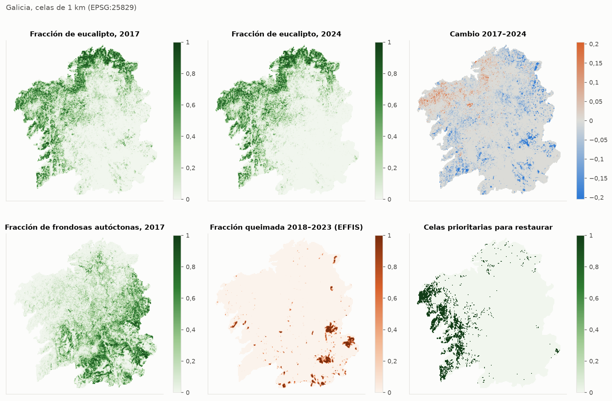
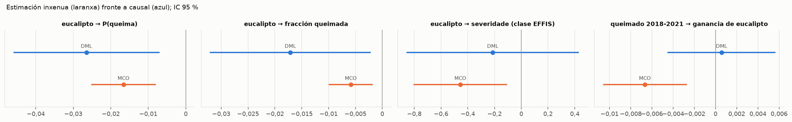
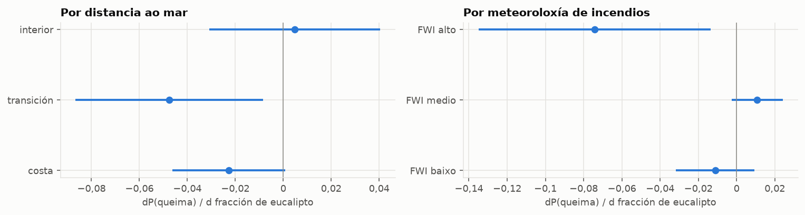
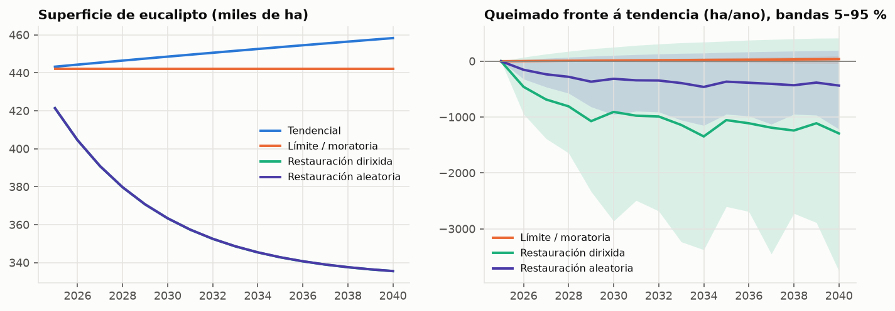

# Eucalipto en Galicia: informe con datos reais

> **Que é este informe.** Unha estimación con datos de satélite e rexistros públicos do
> efecto das plantacións de eucalipto sobre o bosque autóctono e os incendios en Galicia.
> Os mapas de especies adestráronse con etiquetas de OpenStreetMap depuradas, pseudoetiquetas
> de eucalipto e o Mapa Forestal de España (MFE50, arredor de 1998), e compróbanse co MFE50 e
> coas parcelas do Inventario Forestal Nacional (IFN3).
> **Como se validou o mapa de eucalipto.** Case todas as etiquetas de eucalipto de
> OpenStreetMap están nun cadro de 100 km do norte (A Coruña, Ferrol, Ortegal), e moitas das
> de fóra teñen un comportamento invernal de frondosa caducifolia, é dicir, están mal
> etiquetadas. Por iso as etiquetas límpanse segundo o comportamento invernal (o eucalipto é
> perennifolio) e engádense pseudoetiquetas de eucalipto en toda Galicia: arboredo verde e
> húmido no inverno en contornas con cortas a matarrasa 2001–2016. Proba de transferencia:
> adestrando sen o cadro do norte e avaliando nas súas etiquetas de OpenStreetMap, o F1 do
> eucalipto é 0,77 en 2024 (precisión
> 0,69, sensibilidade
> 0,86) e
> 0,68 en 2017. Sen esta corrección era
> practicamente cero. A comprobación independente coas parcelas do IFN3 en toda Galicia
> (sección 2) é máis severa: a superficie total cadra, pero parcela a
> parcela o acordo é baixo.
> Os efectos causais dependen de supostos que se explican na sección 7. O efecto sobre a auga
> **non se puido medir**: hai caudais reais (CAMELS-ES), pero o eucalipto apenas cambia dentro
> das concas nos anos con datos, e o mapa histórico con Landsat non superou a validación
> (sección 6).

## Resumo

- **Superficie de eucalipto (mapa).** 442 mil ha en 2024 e 483 mil ha en 2017 (reconto de píxeles; 450 mil ha en 2024 sumando probabilidades). Compáranse co Mapa Forestal de España (MFE50, arredor de 1998) e co IFN3 na sección 2; non hai unha referencia oficial recente (o MFE25 de 2011 non se puido descargar). Contra 6 903 parcelas do IFN3 (arredor de 1998, publicadas en GBIF), o mapa dá eucalipto no 30,4 % das parcelas arboradas e as parcelas teñen eucalipto no 27,5 %: o total cadra. Parcela a parcela o acordo é baixo (F1 0,45 fóra do norte), en parte porque as parcelas son anteriores a moitas plantacións.
- **Substitución de bosque autóctono.** Entre 2017 e 2024, 99,68 ha pasaron de frondosas autóctonas a eucalipto en píxeles clasificados con fiabilidade nos dous anos; 89,12 ha diso coinciden ademais cunha perda de cuberta arbórea (Hansen) ou cun incendio (EFFIS). Esta última é a cifra máis prudente; a diferenza entre mapas tende a sobreestimar o cambio.
- **Incendios, 2018–2023.** Mantendo constantes o relevo, a localización, a presión humana, a meteoroloxía e as demais cubertas, un aumento de 10 puntos na fracción de eucalipto cambia a probabilidade anual de queima en -0,26 puntos porcentuais (IC 95 %: -0,46 a -0,07). O mato non mostra un efecto distinguible de cero. O valor de robustez é 0,017: un factor de confusión non medido con ese R² parcial co tratamento e co resultado anularía a estimación. No cadro do norte, onde están as etiquetas de OpenStreetMap, o efecto é -0,14 puntos porcentuais por cada 10 puntos de eucalipto (IC 95 %: -0,38 a 0,11; 24 anos-cela queimados), non distinguible de cero. As tres versións do mapa dan a mesma conclusión (2017 retrodatado: -0,26, 2017 independente: -0,16, 2024 (posterior aos lumes): -0,46).
- **Eucalipto fronte a frondosas autóctonas.** O efecto anterior compárase coa agricultura e outros usos, que son os que máis arden. Fronte ás frondosas autóctonas, que son as que menos arden, 10 puntos de eucalipto no canto de frondosas cambian a probabilidade anual de queima en 0,23 puntos porcentuais (IC 95 % aproximado: -0,12 a 0,57; aproximado porque combina dúas estimacións separadas). Este é o contraste que importa para a restauración.
- **Severidade.** Entre as celas queimadas, o efecto do eucalipto sobre a clase de severidade EFFIS é -0,21 por unidade de fracción (EE 0,33; non distinguible de cero; n = 2 146).
- **Do lume á plantación.** Efecto da fracción queimada en 2018–2021 sobre a conversión bruta a eucalipto en 2024: 0,00056 (EE 0,0026), non distinguible de cero.
- **Proxeccións a 2040.** Restaurar o 25 % do eucalipto cambia a superficie queimada media en -961 ha/ano se se fai nas celas prioritarias (banda 5–95 %: -1 737 a 278,8) e en -330,7 ha/ano se se fai ao chou (banda -624,1 a 121,4). As dúas bandas inclúen o cero: as proxeccións non permiten afirmar que restaurar reduza os incendios, nin que os aumente.
- **Auga.** Cos caudais reais de 33 concas galegas (CAMELS-ES, 1992–2020) a estimación non informa: -1 009 mm/ano por 10 puntos de eucalipto, cun IC 95 % de -2 236 a 218. O eucalipto apenas cambia dentro das concas nos anos con caudais, e o mapa histórico con Landsat, que daría ese cambio, non superou a validación (seccións 2 e 6).

## 1. Datos empregados

| fonte | uso | período |
|---|---|---|
| Sentinel-2 L2A (Copernicus, arquivo COG de AWS) | mapas de especies (NDVI, NDMI, NBR mensuais, 40 m) | nov. 2016–set. 2017 (o arquivo L2A comeza en nov. 2016) e out. 2023–set. 2024 |
| OpenStreetMap (vía Overture Maps) | etiquetas de adestramento (tipo de folla, xénero, mato, prados) | 2026 |
| ESA WorldCover | máscara de arboredo e clases non forestais | 2021 |
| Hansen Global Forest Change v1.12 | perda de cuberta arbórea anual, cuberta en 2000 | 2001–2024 |
| EFFIS (severidade de queimados) | área queimada e severidade | 2018–2023 |
| Copernicus DEM (90 m) | altitude e pendente | estático |
| NOAA GHCN-Daily (6 estacións galegas) | anomalías de temperatura e choiva estivais | 2001–2025 |
| Overture Maps, edificacións | presión humana (ignicións) | 2026 |
| Natural Earth | límite de Galicia (catro provincias) | estático |

Panel: 29 565 celas de 1 km e 177 390 anos-cela (2018–2023), dos cales
2 146 rexistraron queimados.

## 2. Mapas de especies

Clasificador de potenciación de gradiente sobre trazos fenolóxicos (media, amplitude e fase anual
de NDVI, NDMI e NBR). Exactitude en validación cruzada por bloques espaciais de 20 km:
**0,801** (2017) e **0,801**
(2024). Kappa 0,757 e 0,757. A exactitude mide o acordo coas
etiquetas de OpenStreetMap, que non son unha mostra aleatoria.

Proba de transferencia (adestramento sen o cadro do norte, avaliación nas súas etiquetas de
OpenStreetMap), F1 por clase:

| clase | 2017 | 2024 |
|---|---|---|
| eucalipto | 0,68 | 0,766 |
| piñeiro | 0,0305 | 0,0915 |
| frondosas autóctonas | 0,323 | 0,405 |
| mato | 0,0335 | 0,183 |
| agricultura | 0,264 | 0,306 |
| outros | 0,964 | 0,966 |

Probáronse tamén as bandas do bordo vermello de Sentinel-2 (B05, B07, B8A), que axudan a distinguir especies. A mellora é pequena e dentro do ruído (F1 do eucalipto na proba do norte 0,721 → 0,727; fronte ao IFN3 0,453 → 0,465), así que o mapa non se cambiou.

Pseudoetiquetas de eucalipto engadidas: 39 445 píxeles
(o mesmo modelo clasifica os dous anos).

O mapa de 2017 retrodátase desde o de 2024: as imaxes de 2017 normalízanse radiometricamente
contra as de 2024 e clasifícanse co mesmo modelo, pero nos píxeles sen perturbación entre os dous
anos (sen perda arbórea de Hansen nin queimado de EFFIS) mantense a clase de 2024. Así, o
ruído do clasificador non crea cambios falsos, e un cambio real precisa de evidencia. Retrodatouse o
90 % dos píxeles.

Superficies. A columna «superficie estimada» corrixe o mapa invertindo a matriz de confusión
da validación cruzada. Esa corrección só é fiable se as etiquetas son puras e representativas;
as de OpenStreetMap non o son, así que **tómese como unha comprobación, non como estimación**.
Se se afasta moito da superficie do mapa, a diferenza indica ruído nas etiquetas máis ca un
erro do mapa.

2024:

| clase | superficie no mapa (ha) | superficie estimada (ha) | IC 95 % (± ha) | superficie por probabilidades (ha) | exactitude do usuario | exactitude do produtor |
|---|---|---|---|---|---|---|
| eucalipto | 442 209 | 387 253 | 2 649 | 449 796 | 0,77495 | 0,88492 |
| piñeiro | 507 492 | 568 136 | 6 004 | 514 828 | 0,73321 | 0,65495 |
| frondosas autóctonas | 550 643 | 538 548 | 4 233 | 557 633 | 0,77942 | 0,79693 |
| mato | 456 348 | 448 471 | 5 045 | 474 582 | 0,70085 | 0,71316 |
| agricultura | 767 717 | 851 700 | 4 317 | 776 675 | 0,88258 | 0,79556 |
| outros | 233 299 | 163 600 | 2 810 | 263 386 | 0,62243 | 0,8876 |

2017:

| clase | superficie no mapa (ha) | superficie estimada (ha) | IC 95 % (± ha) | superficie por probabilidades (ha) | exactitude do usuario | exactitude do produtor |
|---|---|---|---|---|---|---|
| eucalipto | 482 702 | 435 140 | 2 725 | 491 197 | 0,79772 | 0,88492 |
| piñeiro | 499 706 | 558 308 | 5 876 | 507 363 | 0,73175 | 0,65495 |
| frondosas autóctonas | 533 432 | 518 598 | 4 142 | 539 962 | 0,77477 | 0,79693 |
| mato | 439 189 | 425 183 | 4 958 | 456 101 | 0,69041 | 0,71316 |
| agricultura | 771 992 | 859 389 | 4 345 | 781 101 | 0,88562 | 0,79556 |
| outros | 230 687 | 161 091 | 2 825 | 261 176 | 0,61982 | 0,8876 |

### Comprobación co Mapa Forestal de España (MFE50)

O MFE50 de Galicia (MITECO, escala 1:50 000; base cartográfica do IFN3, arredor de 1997–1998)
cobre todo o territorio e indica a formación forestal de cada polígono, así que permite
avaliar os mapas píxel a píxel. Úsanse as formacións puras (eucaliptais, piñeirais, carballeiras
e demais frondosas autóctonas), o monte desarborado como mato, os cultivos e o artificial; as
mesturas exclúense, e cada polígono redúcese un píxel para non avaliar bordos. O MFE25 (base do
IFN4, 2011) está detrás dun control anti-robots no servidor de descargas e non se usou.

| mapa | exactitude global | precisión eucalipto | sensibilidade eucalipto | F1 eucalipto | F1 eucalipto (sen perturbación) | F1 piñeiro | F1 frondosas autóctonas |
|---|---|---|---|---|---|---|---|
| Sentinel-2 2024 | 0,612 | 0,465 | 0,681 | 0,552 | 0,489 | 0,466 | 0,589 |
| Sentinel-2 2017 (retrodatado) | 0,602 | 0,432 | 0,696 | 0,533 | 0,489 | 0,437 | 0,588 |
| Sentinel-2 2017 (independente) | 0,467 | 0,313 | 0,554 | 0,4 | 0,323 | 0,254 | 0,391 |
| Landsat 1990 | 0,602 | 0,405 | 0,746 | 0,525 | 0,439 | 0,435 | 0,601 |
| Landsat 2000 | 0,63 | 0,442 | 0,804 | 0,57 | 0,477 | 0,458 | 0,621 |
| Landsat 2010 | 0,614 | 0,403 | 0,708 | 0,513 | 0,43 | 0,436 | 0,619 |
| Landsat 2017 | 0,617 | 0,413 | 0,723 | 0,526 | 0,44 | 0,454 | 0,614 |

A referencia é de arredor de 1998, así que parte do desacordo cos mapas recentes é cambio
real; a columna «sen perturbación» limítase a píxeles sen corta nin lume rexistrados desde
2001.

As etiquetas do MFE50 tamén se usan no adestramento (en píxeles sen perturbación desde 2001).
Nun experimento por bloques de 10 km, adestrando nunha metade e avaliando na outra, melloraron o
mapa: exactitude fronte ao MFE50 0,546 → 0,609, F1
do eucalipto 0,501 → 0,534, e F1 fronte ás
parcelas do IFN3 0,454 → 0,47. Os mapas deste informe
xa os inclúen; por iso a táboa de arriba está en parte dentro da mostra de adestramento.

### Comprobación con parcelas de inventario forestal

O Mapa Forestal de España e o IFN4 non se podían descargar desde este contorno, pero o arquivo
de GBIF contén as parcelas do **Terceiro Inventario Forestal Nacional (IFN3)**, publicadas polo
Ministerio (código de institución MAGRAMA, colección IFN3, licenza CC BY-NC 4.0): unha malla
sistemática de 1 km coa lista de especies de cada parcela, sen número de pés nin data. O
traballo de campo do IFN3 en Galicia foi arredor de 1997–1998, así que as parcelas son dúas
décadas anteriores aos mapas de Sentinel-2. Quedan 6 903 parcelas. Por ser unha
mostra sistemática, dá unha precisión de deseño, non só a sensibilidade.

Unha parcela conta como «eucalipto» se a lista inclúe algún eucalipto; non se sabe se domina.
Precisión: das parcelas que o mapa chama eucalipto, fracción que ten eucalipto. Sensibilidade:
das parcelas con eucalipto, fracción que o mapa chama eucalipto.

Mapa de 2024:

| subconxunto | parcelas | parcelas con eucalipto | sensibilidade | precisión | F1 | parcelas sen eucalipto que o mapa chama eucalipto |
|---|---|---|---|---|---|---|
| todos | 6 238 | 1 340 | 0,555 | 0,396 | 0,462 | 0,232 |
| fóra do cadro do norte | 5 836 | 1 182 | 0,53 | 0,386 | 0,447 | 0,214 |
| fóra dos polígonos de adestramento | 5 713 | 1 282 | 0,545 | 0,391 | 0,456 | 0,245 |
| cadro do norte | 402 | 158 | 0,747 | 0,456 | 0,566 | 0,578 |

Mapa de 2017 retrodatado:

| subconxunto | parcelas | parcelas con eucalipto | sensibilidade | precisión | F1 | parcelas sen eucalipto que o mapa chama eucalipto |
|---|---|---|---|---|---|---|
| todos | 6 238 | 1 340 | 0,572 | 0,379 | 0,456 | 0,256 |
| fóra do cadro do norte | 5 836 | 1 182 | 0,547 | 0,368 | 0,44 | 0,239 |
| fóra dos polígonos de adestramento | 5 713 | 1 282 | 0,56 | 0,379 | 0,452 | 0,265 |
| cadro do norte | 402 | 158 | 0,759 | 0,456 | 0,57 | 0,586 |

Mapa de 2017 clasificado de forma independente:

| subconxunto | parcelas | parcelas con eucalipto | sensibilidade | precisión | F1 | parcelas sen eucalipto que o mapa chama eucalipto |
|---|---|---|---|---|---|---|
| todos | 6 238 | 1 340 | 0,484 | 0,318 | 0,384 | 0,284 |
| fóra do cadro do norte | 5 836 | 1 182 | 0,469 | 0,3 | 0,366 | 0,278 |
| fóra dos polígonos de adestramento | 5 713 | 1 282 | 0,476 | 0,326 | 0,387 | 0,284 |
| cadro do norte | 402 | 158 | 0,601 | 0,487 | 0,538 | 0,41 |

Clase do mapa de 2024 segundo o tipo de parcela (fracción de parcelas):

| tipo de parcela | parcelas | eucalipto | piñeiro | frondosas autóctonas | mato | agricultura | outros |
|---|---|---|---|---|---|---|---|
| eucalipto | 1 393 | 0,534 | 0,161 | 0,0538 | 0,0553 | 0,11 | 0,0481 |
| piñeiro sen eucalipto | 1 966 | 0,221 | 0,343 | 0,111 | 0,0793 | 0,137 | 0,0392 |
| frondosas sen eucalipto nin piñeiro | 1 699 | 0,131 | 0,175 | 0,31 | 0,0465 | 0,152 | 0,0294 |
| só mato | 1 845 | 0,26 | 0,254 | 0,14 | 0,0938 | 0,102 | 0,0352 |

Que se conclúe:

- **No agregado o mapa achégase.** O 30,4 % das
  parcelas arboradas está no mapa como eucalipto, e o 27,5 %
  das parcelas arboradas ten eucalipto no inventario de 1998.
- **Parcela a parcela o acordo é baixo**: F1 0,46 en toda Galicia e
  0,45 fóra do norte, lonxe do
  0,77 da proba de transferencia con OpenStreetMap. Esa proba era optimista.
- **O tempo explica só unha parte.** Das parcelas sen eucalipto que o mapa chama eucalipto, o
  77,2 % tivo corta ou lume desde 2001 (o primeiro
  ano de Hansen), fronte ao 45,4 % do resto: algunhas
  son plantacións posteriores ao inventario. Un mapa da mesma época (Landsat 2000) concorda mellor (F1 0,49).
- **Adestrar coas parcelas non mellora o mapa.** Nun experimento, as parcelas da metade dos bloques de 10 km (1 341 sen perturbación desde 2001) engadíronse ao adestramento e avaliouse nas 3 133 da outra metade: F1 0,44 co mapa actual e 0,42–0,44 coas parcelas; adestrando só coas parcelas, 0,26. Unha parcela con algún eucalipto non é unha boa etiqueta para un píxel de 40 m, así que este acordo é en parte un teito da referencia, non só do mapa.

Consecuencia: as cifras de superficie son plausibles, pero a localización do eucalipto píxel a
píxel é incerta. Os efectos estimados sobre os incendios están atenuados por este erro
(sección 7).

### Mapa histórico con Landsat, 1990–2017

Para ter un historial de cuberta máis longo (sección 6) clasificáronse imaxes Landsat 4–8 da Colección 2, nivel 2 (reflectancia de superficie, Microsoft Planetary Computer): compostos mensuais de NDVI, NDMI e NBR con todas as escenas despexadas de cada época de tres anos, cos mesmos trazos fenolóxicos ca os mapas de Sentinel-2.
Cada época ten o seu clasificador, adestrado en píxeles sen cambios desde 2001 (mesma clase
nos dous mapas de Sentinel-2, sen perda de Hansen nin lume).

| época | exactitude (validación cruzada) | F1 eucalipto (validación cruzada) | eucalipto (mil ha) | F1 fronte ao IFN3 |
|---|---|---|---|---|
| 1990 | 0,675 | 0,668 | 571 | 0,477 |
| 2000 | 0,725 | 0,711 | 570 | 0,491 |
| 2010 | 0,759 | 0,711 | 552 | 0,453 |
| 2017 | 0,81 | 0,775 | 543 | 0,466 |

Comprobación de cambio: dos píxeles que pasan a eucalipto entre 2000 e 2010, o
3,9 % tivo unha corta rexistrada por Hansen en 2001–2010,
fronte ao 2,2 % dos píxeles sen cambio. Unha plantación
nova vén case sempre dunha corta, así que a proporción debería ser moito maior.

**O mapa histórico non supera a validación, e non se usa.** Mesmo con reflectancia de superficie e todas as escenas despexadas, Landsat a 30–60 m non separa o eucalipto do piñeiro o bastante para datar o cambio: o «cambio» entre épocas segue sendo maioritariamente ruído de clasificación.

### Comprobación con observacións de GBIF

Observacións directas de árbores e matogueiras en Galicia (iNaturalist, Observation.org e
outras), incerteza de coordenadas de 60 m como máximo, 2019–2025, un rexistro por xénero e
píxel: 4 516 puntos. Os naturalistas case non rexistran plantacións, así que hai
poucos puntos de eucalipto, e para 2017 non abondan. Precisión e F1 calculadas supoñendo que o
eucalipto é o 29,5 % do arboredo. A columna «3×3 píxeles» acepta o
acerto nun píxel veciño.

| subconxunto | puntos de eucalipto | puntos doutro arboredo | sensibilidade | IC 95 % inferior | IC 95 % superior | sensibilidade (3×3 píxeles) | arboredo tomado por eucalipto | precisión (prevalencia do mapa) | F1 (prevalencia do mapa) |
|---|---|---|---|---|---|---|---|---|---|
| todos | 84 | 2 332 | 0,393 | 0,295 | 0,5 | 0,702 | 0,0823 | 0,666 | 0,494 |
| fóra do cadro do norte | 80 | 2 133 | 0,388 | 0,288 | 0,497 | 0,7 | 0,0689 | 0,701 | 0,499 |
| fóra do norte e dos polígonos | 79 | 2 091 | 0,392 | 0,292 | 0,503 | 0,709 | 0,0689 | 0,704 | 0,504 |

Fracción dos puntos de cada xénero que o mapa de 2024 clasifica como eucalipto:

| xénero | puntos | fracción no mapa como eucalipto |
|---|---|---|
| Erica | 1 097 | 0,143 |
| Ilex | 522 | 0,0881 |
| Quercus | 423 | 0,109 |
| Alnus | 342 | 0,0556 |
| Cytisus | 323 | 0,0898 |
| Castanea | 296 | 0,128 |
| Ulex | 277 | 0,152 |
| Calluna | 245 | 0,147 |
| Fraxinus | 163 | 0,0307 |
| Fagus | 162 | 0,105 |
| Genista | 158 | 0,0759 |
| Arbutus | 149 | 0,0336 |
| Sorbus | 140 | 0,0143 |
| Eucalyptus | 84 | 0,393 |
| Betula | 68 | 0,0882 |
| Pinus | 67 | 0,119 |

## 3. Perda de bosque autóctono

Transicións cara ao eucalipto, 2017–2024 (píxeles de 40 m):

| de | a | superficie (ha) | superficie, píxeles fiables (ha) |
|---|---|---|---|
| piñeiro | eucalipto | 8 568 | 1 506 |
| frondosas autóctonas | eucalipto | 1 477 | 99,68 |
| mato | eucalipto | 3 752 | 546,56 |
| agricultura | eucalipto | 7 943 | 1 855 |
| outros | eucalipto | 717,6 | 56,48 |

A diferenza entre dous mapas acumula os erros de ambos e sobreestima o cambio (na validación
sintética, ao redor do dobre). Por iso o informe dá tres cifras para autóctonas → eucalipto:
todos os píxeles, 1 477 ha; píxeles fiables, 99,7 ha;
e píxeles fiables con perda arbórea ou incendio que o corroboren,
89,1 ha. A última é a máis prudente.

Atribución da perda de cuberta arbórea 2018–2024 (Hansen) a 40 m:

| causa | atribuída | proporción atribuída |
|---|---|---|
| incendio | 42 724 | 0,1717 |
| corta de rotación | 111 485 | 0,4479 |
| conversión | 7 343 | 0,0295 |
| perda de frondosas sen conversión | 7 437 | 0,02988 |
| sen atribuír | 79 908 | 0,321 |

## 4. Incendios

| efecto | método | estimación | EE | puntos |
|---|---|---|---|---|
| eucalipto → P(queima) | MCO | -0,01659 | 0,004394 | 177 390 |
| eucalipto → P(queima) | DML | -0,02649 | 0,009941 | 177 390 |
| eucalipto → fracción queimada | MCO | -0,005867 | 0,002104 | 177 390 |
| eucalipto → fracción queimada | DML | -0,01713 | 0,007638 | 177 390 |
| eucalipto → severidade (clase EFFIS) | MCO | -0,4558 | 0,1786 | 2 146 |
| eucalipto → severidade (clase EFFIS) | DML | -0,2142 | 0,3289 | 2 146 |
| queimado 2018-2021 → ganancia de eucalipto | MCO | -0,006664 | 0,002017 | 28 282 |
| queimado 2018-2021 → ganancia de eucalipto | DML | 0,0005614 | 0,002595 | 28 282 |

Efecto de cada cuberta sobre a probabilidade anual de queima, fronte a agricultura e outros usos:

| cuberta | dP(queima)/dfracción | EE |
|---|---|---|
| eucalipto | -0,02649 | 0,009941 |
| piñeiro | -0,03797 | 0,01553 |
| frondosas autóctonas | -0,04913 | 0,01443 |
| mato | -0,01598 | 0,01323 |

Onde é maior o efecto do eucalipto:

| grupo | estimación | EE | puntos |
|---|---|---|---|
| costa | -0,02275 | 0,01199 | 59 208 |
| transición | -0,0475 | 0,01995 | 59 100 |
| interior | 0,00474 | 0,01816 | 59 082 |

| grupo | estimación | EE | puntos |
|---|---|---|---|
| FWI baixo | -0,0112 | 0,01043 | 59 130 |
| FWI medio | 0,01077 | 0,00682 | 59 130 |
| FWI alto | -0,07433 | 0,03097 | 59 130 |

Sensibilidade ao mapa de eucalipto (efecto sobre a probabilidade anual de queima por unidade
de fracción):

| mapa | estimación | EE | IC 95 % inferior | IC 95 % superior |
|---|---|---|---|---|
| 2017 retrodatado | -0,02649 | 0,009941 | -0,04598 | -0,007008 |
| 2017 independente | -0,01585 | 0,008087 | -0,0317 | -1,971e-06 |
| 2024 (posterior aos lumes) | -0,04641 | 0,01349 | -0,07285 | -0,01998 |

**Comprobación sobre o terreo, sen mapa.** As parcelas do IFN3 (arredor de 1998) din
onde había eucalipto antes dos lumes de 2018–2023, sen erro de clasificación. Resultado:
probabilidade anual de que ardese o píxel da parcela, segundo EFFIS, cos mesmos controis a
1 km e a presenza de piñeiro ou frondosas na parcela (6 222 parcelas,
1 333 con eucalipto; só 122 arderon).

- Taxas brutas: 0,14 % ao ano nas parcelas con eucalipto e
  0,38 % nas demais.
- Efecto con controis (DML): -0,052 puntos porcentuais (IC 95 %: -0,16 a 0,054), non distinguible de cero.
- Parcelas só de eucalipto fronte a parcelas con piñeiro: -0,1 puntos porcentuais (IC 95 %: -0,26 a 0,053); fronte a
  parcelas con frondosas: -0,15 puntos porcentuais (IC 95 %: -0,41 a 0,11).

As escalas non son comparables coas da táboa anterior (un punto fronte a unha cela de 1 km),
así que só conta o signo: sobre o terreo tampouco hai sinal de que o eucalipto arda máis. Con
tan poucas parcelas queimadas a comprobación ten pouca potencia, e non resolve o contraste co
bosque autóctono.

Sensibilidade á confusión non observada:

| efecto | estimación | VR da estimación | VR do IC | nesgo máx. (R² = 0,02) | nesgo máx. (R² = 0,05) |
|---|---|---|---|---|---|
| eucalipto → P(queima) | -0,02649 | 0,01746 | 0,004649 | 0,03038 | 0,07714 |
| eucalipto → fracción queimada | -0,01713 | 0,02265 | 0,00289 | 0,01511 | 0,03836 |
| eucalipto → severidade (clase EFFIS) | -0,2142 | 0,02118 | 0 | 0,2022 | 0,5133 |

Erro estándar do efecto sobre a aparición de incendios segundo o tamaño do bloque:

| bloque (km) | EE |
|---|---|
| 5 | 0,006581 |
| 10 | 0,008765 |
| 20 | 0,01053 |
| 40 | 0,012 |
| 80 | 0,0137 |

Modelo de susceptibilidade: AUC en validación cruzada espacial 0,887.

## 5. Proxeccións ano a ano, 2025–2040

Motor dinámico: cada ano sortéase o lume segundo a susceptibilidade de cada cela e os efectos
causais estimados de cada cuberta; o lume converte parte das frondosas e dos piñeirais en mato;
e a plantación de eucalipto segue a taxa de conversión bruta observada en 2017–2024 entre
píxeles fiables (0,092 % ao ano da
superficie sen eucalipto), reforzada polos incendios recentes. O motor non inclúe perdas de
eucalipto agás a restauración, así que o crecemento no escenario tendencial é un límite superior. O modelo validouse na paisaxe sintética (1 km), onde sobreestimou uns 40 % os beneficios
da restauración e moito máis os do límite, porque sobreestima a plantación de referencia. As bandas son os percentís 5 e 95 de 40 simulacións que combinan a
variabilidade meteorolóxica e a incerteza dos efectos.

| escenario | Δ eucalipto (ha) | Δ frondosas autóctonas (ha) | Δ queimado medio (ha/ano) | percentil 5 | percentil 95 |
|---|---|---|---|---|---|
| Límite / moratoria | -16 171 | 285,5 | 18,76 | -20,81 | 46,86 |
| Restauración dirixida | -122 771 | 106 885 | -961 | -1 737 | 278,8 |
| Restauración aleatoria | -122 740 | 106 855 | -330,7 | -624,1 | 121,4 |

Sensibilidade: se a plantación futura fose a metade da observada en 2017–2024 (por exemplo,
porque se manteñen as restricións a novas plantacións):

| escenario | Δ eucalipto (ha) | Δ frondosas autóctonas (ha) | Δ queimado medio (ha/ano) | percentil 5 | percentil 95 |
|---|---|---|---|---|---|
| Límite / moratoria | -8 418 | 138,6 | 9,753 | -10,59 | 24 |

## 6. Auga

**Estimación con aforos reais (CAMELS-ES).** CAMELS-ES (Zenodo, CC BY 4.0) recolle
caudais diarios, choiva e evapotranspiración de referencia (EMO-1) de estacións de aforo
españolas. Úsanse as 33 concas con polo menos o 80 % da superficie en Galicia,
anos hidrolóxicos 1992–2020 (608
anos-conca; escorrentía media 900 mm/ano). Modelo de efectos fixos
de conca e ano, con choiva, evapotranspiración e as outras cubertas como controis.

| cuberta empregada | cambio do eucalipto dentro da conca (puntos) | escorrentía (mm/ano por 10 puntos) | EE | caudal mínimo 7 días (mm/día por 10 puntos) | EE caudal mínimo |
|---|---|---|---|---|---|
| Sentinel-2, 2017 retrodatado | 0,57 | -1 009 | 626 | 0,155 | 0,457 |
| Sentinel-2, 2017 independente | 0,57 | -1 009 | 626 | 0,155 | 0,457 |

As dúas versións do mapa de 2017 dan o mesmo resultado porque só difiren en píxeles sen perturbación, cuxo cambio se data en 2021, despois do último ano con caudais (2020).

Resultado principal: un aumento de 10 puntos de eucalipto cambia a escorrentía anual en
-1 009 mm (IC 95 %: -2 236 a 218) e o caudal
mínimo de 7 días en 0,16 mm/día (IC 95 %: -0,74 a
1,1). **O intervalo é tan largo que a estimación non informa**: dentro de cada conca o eucalipto apenas cambia nos anos con caudais, e sen un historial de cuberta máis longo os aforos non poden medir o efecto.

Por que non abonda: proba de potencia nas concas trazadas co modelo do terreo, con caudais
simulados cun efecto coñecido.

- **Concas.** Delimitáronse desde o modelo dixital do terreo Copernicus (200 m) 79
  concas enteiras, sen aniñar, de 30 a 1 500 km² (mediana 113 km²),
  que representan unha rede de aforos. Clima de cada ano hidrolóxico (outubro–setembro):
  choiva e evapotranspiración potencial (Thornthwaite) das estacións GHCN. Cuberta de cada conca e
  ano: os mapas de 2017 e 2024, co cambio datado pola perda arbórea de Hansen ou polo incendio.
- **Problema principal.** O eucalipto medio das concas en 2024 é do
  18,3 %, pero dentro de cada conca só cambia
  2,1 puntos de media entre 2017 e 2024 (percentil 90:
  4,3). Un panel de concas con efectos fixos só aprende deste
  cambio interno.
- **Proba de potencia.** Simuláronse caudais nas concas reais co clima real e un efecto
  coñecido do eucalipto (curva de Fu con parámetro propio de cada conca, choque anual común e
  erro do 8 % por conca e ano), e estimouse o efecto co mesmo modelo de efectos fixos dobres,
  200 veces por caso. O nesgo é pequeno fronte ao erro típico e a cobertura do IC 95 % está
  preto do 95 % (sen nesgo apreciable cun historial máis longo), pero coas
  79 concas o efecto mínimo detectable (potencia do 80 %) é de
  **118 mm/ano por 10 puntos** de eucalipto. Aquí suponse que un efecto plausible, de
  substituír frondosas por eucalipto, é de 10–20 mm/ano por 10 puntos (100–200 mm/ano nunha
  conca enteira).
  «Cambio de cuberta × 3» ou «× 6» simula un historial máis longo (por exemplo, mapas desde os
  anos noventa con Landsat), que é o que faría detectable un efecto de 10–20 mm/ano.

Efecto mínimo detectable:

| cambio de cuberta (× o real) | concas | efecto mínimo detectable (mm/ano por 10 puntos) |
|---|---|---|
| 1 | 20 | 354 |
| 1 | 40 | 199 |
| 1 | 79 | 118 |
| 3 | 20 | 98 |
| 3 | 40 | 57,2 |
| 3 | 79 | 42 |
| 6 | 20 | 46,8 |
| 6 | 40 | 29,9 |
| 6 | 79 | 20,1 |

Resultados co número máximo de concas:

| cambio de cuberta (× o real) | efecto real (mm/ano por 10 puntos) | estimación media | nesgo | cobertura IC 95 % | potencia |
|---|---|---|---|---|---|
| 1 | 0 | -3,21 | -3,21 | 0,945 | 0,055 |
| 1 | -10 | -15,4 | -5,44 | 0,9 | 0,1 |
| 1 | -20 | -26,1 | -6,14 | 0,925 | 0,135 |
| 1 | -40 | -53,6 | -13,6 | 0,92 | 0,265 |
| 3 | 0 | -1,99 | -1,99 | 0,91 | 0,09 |
| 3 | -10 | -11,1 | -1,07 | 0,93 | 0,16 |
| 3 | -20 | -21,1 | -1,11 | 0,915 | 0,35 |
| 3 | -40 | -44 | -4,02 | 0,945 | 0,87 |
| 6 | 0 | -1,53 | -1,53 | 0,91 | 0,09 |
| 6 | -10 | -10,7 | -0,748 | 0,925 | 0,43 |
| 6 | -20 | -19,8 | 0,216 | 0,94 | 0,865 |
| 6 | -40 | -40,7 | -0,677 | 0,925 | 1 |

Con erro de mapa realista (caudais simulados co mapa de 2017 independente, estimación co
retrodatado):

| cambio de cuberta (× o real) | efecto real (mm/ano por 10 puntos) | estimación media | nesgo | cobertura IC 95 % | potencia |
|---|---|---|---|---|---|
| 1 | 0 | -10,4 | -10,4 | 0,92 | 0,08 |
| 1 | -20 | -98,8 | -78,8 | 0,575 | 0,59 |
| 6 | 0 | -1,32 | -1,32 | 0,885 | 0,115 |
| 6 | -20 | -50,9 | -30,9 | 0,05 | 1 |

O erro de mapa pesa tanto coma o ruído: coa mesma conca e o mesmo caudal, cambiar de versión
do mapa multiplica a estimación por 2,5 (e a cobertura do IC cae). Por iso calquera
estimación con aforos debería repetirse coas dúas versións do mapa, como se fai cos incendios.

Conclusión: **cos mapas dispoñibles (2017 e 2024), nin sequera cos aforos se podería medir o efecto do eucalipto sobre o caudal anual**. Fai falta un historial de cuberta máis longo (Landsat desde os anos noventa) ou un deseño de concas pareadas. Intentouse ese historial con Landsat (sección 2), pero o mapa histórico non superou a validación.

## 7. Limitacións

- **Etiquetas.** As etiquetas de especie proceden de OpenStreetMap: 80 083
  píxeles de adestramento de eucalipto en 2024, a clase con menos exemplos. Supúxose que o
  bosque frondoso perennifolio de Galicia é eucalipto; as aciñeiras e sobreiras quedarían mal
  clasificadas. A comprobación con GBIF (sección 2) é independente pero oportunista; a
  validación definitiva debe facerse co Mapa Forestal de España ou co IFN4.
- **Erro do mapa.** As parcelas de inventario mostran que o erro de localización do eucalipto
  é grande, e ese erro atenúa os efectos cara a cero. Non se aplicou SIMEX porque as parcelas
  (presenza de eucalipto nun círculo de 25 m, sen data) non miden o mesmo ca o píxel, así que
  non dan a varianza do erro.
- **Incendios.** EFFIS rexistra sobre todo os incendios grandes; os pequenos quedan fóra. Só hai
  seis anos (2018–2023) e 2022 domina o total.
- **Causalidade.** Os efectos son causais só se non queda confusión relevante sen medir (por
  exemplo, a intencionalidade dos lumes ou a propiedade das terras). A táboa de sensibilidade
  indica canto tería que pesar ese factor.
- **Meteoroloxía.** O índice meteorolóxico procede de seis estacións; non é o FWI oficial.

## Siglas

| sigla | significado |
|---|---|
| AUC | área baixo a curva ROC |
| DML | aprendizaxe automática dobre (estimación causal con axustes cruzados) |
| EE | erro estándar |
| EFFIS | Sistema Europeo de Información sobre Incendios Forestais |
| FWI | índice meteorolóxico de perigo de incendio |
| GBIF | Global Biodiversity Information Facility (rexistros de biodiversidade) |
| IFN3, IFN4 | Terceiro e Cuarto Inventario Forestal Nacional |
| GHCN | rede mundial de estacións meteorolóxicas da NOAA |
| IC | intervalo de confianza |
| MCO | mínimos cadrados ordinarios (estimación inxenua) |
| VR | valor de robustez |
