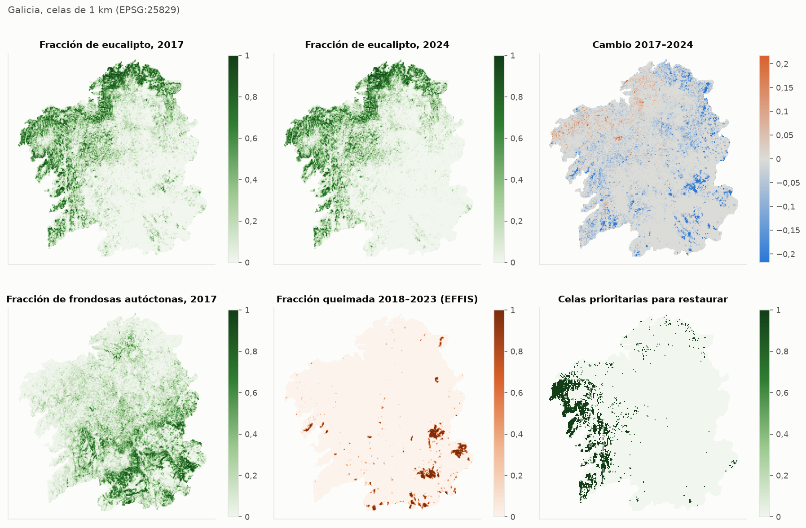
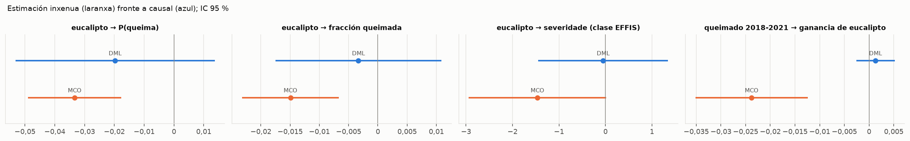
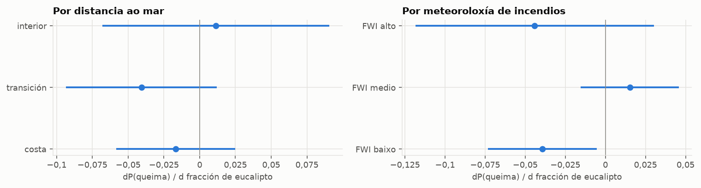
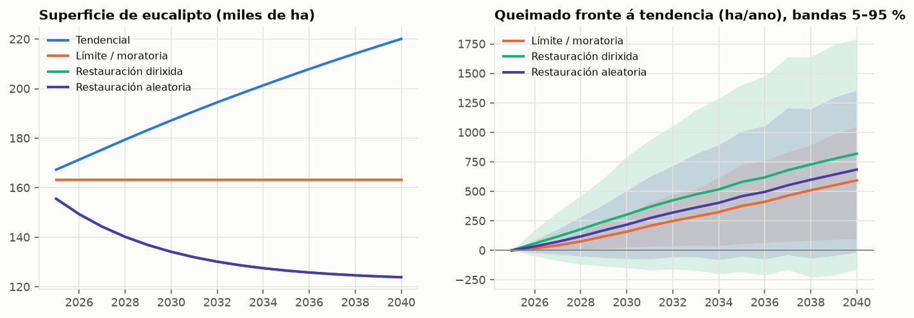

# Eucalipto en Galicia: informe con datos reais

> **Que é este informe.** Unha estimación con datos de satélite e rexistros públicos do
> efecto das plantacións de eucalipto sobre o bosque autóctono e os incendios en Galicia.
> Os mapas de especies adestráronse con etiquetas de OpenStreetMap, non co Mapa Forestal de
> España nin co Inventario Forestal Nacional, que non eran accesibles desde este contorno.
> **Como se validou o mapa de eucalipto.** Case todas as etiquetas de eucalipto de
> OpenStreetMap están nun cadro de 100 km do norte (A Coruña, Ferrol, Ortegal), e moitas das
> de fóra teñen un comportamento invernal de frondosa caducifolia, é dicir, están mal
> etiquetadas. Por iso as etiquetas límpanse segundo o comportamento invernal (o eucalipto é
> perennifolio) e engádense pseudoetiquetas de eucalipto en toda Galicia: arboredo verde e
> húmido no inverno en contornas con cortas a matarrasa 2001–2016. Proba de transferencia:
> adestrando sen o cadro do norte e avaliando nas súas etiquetas de OpenStreetMap, o F1 do
> eucalipto é 0,72 en 2024 (precisión
> 0,69, sensibilidade
> 0,75) e
> 0,65 en 2017. Sen esta corrección era
> practicamente cero. A comprobación independente coas parcelas do IFN3 en toda Galicia
> (sección 2) é máis severa: a superficie total cadra, pero parcela a
> parcela o acordo é baixo.
> Os efectos causais dependen de supostos que se explican na sección 7. O efecto sobre a auga
> **non se puido estimar** con datos reais; a sección 6 avalía se sería medible con aforos.

## Resumo

- **Superficie de eucalipto (mapa).** 440 mil ha en 2024 e 489 mil ha en 2017 (reconto de píxeles; 447 mil ha en 2024 sumando probabilidades). **Estas cifras non están validadas** co inventario oficial descargado do Ministerio (IFN, Mapa Forestal de España): compárense con el antes de citalas (sección 2). Contra 6 903 parcelas do IFN3 (arredor de 1998, publicadas en GBIF), o mapa dá eucalipto no 28,1 % das parcelas arboradas e as parcelas teñen eucalipto no 27,5 %: o total cadra. Parcela a parcela o acordo é baixo (F1 0,44 fóra do norte), en parte porque as parcelas son anteriores a moitas plantacións.
- **Substitución de bosque autóctono.** Entre 2017 e 2024, 563,2 ha pasaron de frondosas autóctonas a eucalipto en píxeles clasificados con fiabilidade nos dous anos; 484 ha diso coinciden ademais cunha perda de cuberta arbórea (Hansen) ou cun incendio (EFFIS). Esta última é a cifra máis prudente; a diferenza entre mapas tende a sobreestimar o cambio.
- **Incendios, 2018–2023.** Mantendo constantes o relevo, a localización, a presión humana, a meteoroloxía e as demais cubertas, un aumento de 10 puntos na fracción de eucalipto cambia a probabilidade anual de queima en -0,27 puntos porcentuais (IC 95 %: -0,46 a -0,076). O mato non mostra un efecto distinguible de cero. O valor de robustez é 0,018: un factor de confusión non medido con ese R² parcial co tratamento e co resultado anularía a estimación. No cadro do norte, onde están as etiquetas de OpenStreetMap, o efecto é -0,34 puntos porcentuais por cada 10 puntos de eucalipto (IC 95 %: -0,54 a -0,14; 24 anos-cela queimados). As versións do mapa coinciden no signo (2017 retrodatado: -0,27, 2017 independente: -0,15, 2024 (posterior aos lumes): -0,42), pero non todas son distinguibles de cero: o resultado é sensible ao mapa.
- **Eucalipto fronte a frondosas autóctonas.** O efecto anterior compárase coa agricultura e outros usos, que son os que máis arden. Fronte ás frondosas autóctonas, que son as que menos arden, 10 puntos de eucalipto no canto de frondosas cambian a probabilidade anual de queima en 0,39 puntos porcentuais (IC 95 % aproximado: -0,018 a 0,79; aproximado porque combina dúas estimacións separadas). Este é o contraste que importa para a restauración.
- **Severidade.** Entre as celas queimadas, o efecto do eucalipto sobre a clase de severidade EFFIS é -0,24 por unidade de fracción (EE 0,28; non distinguible de cero; n = 2 146).
- **Do lume á plantación.** Efecto da fracción queimada en 2018–2021 sobre a conversión bruta a eucalipto en 2024: 0,0063 (EE 0,0088), non distinguible de cero.
- **Proxeccións a 2040.** Restaurar o 25 % do eucalipto cambia a superficie queimada media en -2 499 ha/ano se se fai nas celas prioritarias (banda 5–95 %: -3 577 a -866,9) e en -714,8 ha/ano se se fai ao chou (banda -1 077 a -244,2). Ao menos unha banda exclúe o cero, pero as proxeccións herdan a sensibilidade ao mapa descrita arriba.
- **Auga.** Sen datos de caudal non hai estimación. Unha proba de potencia nas 79 concas reais mostra que, cos mapas de 2017 e 2024, os aforos só detectarían un efecto de 139 mm/ano por 10 puntos de eucalipto ou maior; fai falta un historial de cuberta máis longo (sección 6).

## 1. Datos empregados

| fonte | uso | período |
|---|---|---|
| Sentinel-2 L2A (Copernicus, arquivo COG de AWS) | mapas de especies (NDVI, NDMI, NBR mensuais, 40 m) | nov. 2016–set. 2017 (o arquivo L2A comeza en nov. 2016) e out. 2023–set. 2024 |
| OpenStreetMap (vía Overture Maps) | etiquetas de adestramento (tipo de folla, xénero, mato, prados) | 2026 |
| ESA WorldCover | máscara de arboredo e clases non forestais | 2021 |
| Hansen Global Forest Change v1.12 | perda de cuberta arbórea anual, cuberta en 2000 | 2001–2024 |
| EFFIS (severidade de queimados) | área queimada e severidade | 2018–2023 |
| Copernicus DEM (90 m) | altitude e pendente | estático |
| NOAA GHCN-Daily (6 estacións galegas) | anomalías de temperatura e choiva estivais | 2001–2025 |
| Overture Maps, edificacións | presión humana (ignicións) | 2026 |
| Natural Earth | límite de Galicia (catro provincias) | estático |

Panel: 29 565 celas de 1 km e 177 390 anos-cela (2018–2023), dos cales
2 146 rexistraron queimados.

## 2. Mapas de especies

Clasificador de potenciación de gradiente sobre trazos fenolóxicos (media, amplitude e fase anual
de NDVI, NDMI e NBR). Exactitude en validación cruzada por bloques espaciais de 20 km:
**0,875** (2017) e **0,875**
(2024). Kappa 0,845 e 0,845. A exactitude mide o acordo coas
etiquetas de OpenStreetMap, que non son unha mostra aleatoria.

Proba de transferencia (adestramento sen o cadro do norte, avaliación nas súas etiquetas de
OpenStreetMap), F1 por clase:

| clase | 2017 | 2024 |
|---|---|---|
| eucalipto | 0,652 | 0,721 |
| piñeiro | 0,0518 | 0,0895 |
| frondosas autóctonas | 0,314 | 0,461 |
| mato | 0,037 | 0,166 |
| agricultura | 0,28 | 0,287 |
| outros | 0,966 | 0,969 |

Pseudoetiquetas de eucalipto engadidas: 39 445 píxeles
(o mesmo modelo clasifica os dous anos).

O mapa de 2017 retrodátase desde o de 2024: as imaxes de 2017 normalízanse radiometricamente
contra as de 2024 e clasifícanse co mesmo modelo, pero nos píxeles sen perturbación entre os dous
anos (sen perda arbórea de Hansen nin queimado de EFFIS) mantense a clase de 2024. Así, o
ruído do clasificador non crea cambios falsos, e un cambio real precisa de evidencia. Retrodatouse o
90 % dos píxeles.

Superficies. A columna «superficie estimada» corrixe o mapa invertindo a matriz de confusión
da validación cruzada. Esa corrección só é fiable se as etiquetas son puras e representativas;
as de OpenStreetMap non o son, así que **tómese como unha comprobación, non como estimación**.
Se se afasta moito da superficie do mapa, a diferenza indica ruído nas etiquetas máis ca un
erro do mapa.

2024:

| clase | superficie no mapa (ha) | superficie estimada (ha) | IC 95 % (± ha) | superficie por probabilidades (ha) | exactitude do usuario | exactitude do produtor |
|---|---|---|---|---|---|---|
| eucalipto | 439 558 | 402 700 | 2 312 | 447 317 | 0,87601 | 0,95619 |
| piñeiro | 625 464 | 643 905 | 5 557 | 636 351 | 0,81643 | 0,79305 |
| frondosas autóctonas | 522 367 | 509 358 | 3 967 | 528 704 | 0,85269 | 0,87446 |
| mato | 389 633 | 364 617 | 4 832 | 405 262 | 0,72006 | 0,76947 |
| agricultura | 736 967 | 850 757 | 5 236 | 745 316 | 0,94326 | 0,8171 |
| outros | 243 718 | 186 370 | 2 777 | 273 951 | 0,71746 | 0,93823 |

2017:

| clase | superficie no mapa (ha) | superficie estimada (ha) | IC 95 % (± ha) | superficie por probabilidades (ha) | exactitude do usuario | exactitude do produtor |
|---|---|---|---|---|---|---|
| eucalipto | 488 611 | 455 084 | 2 322 | 497 303 | 0,89058 | 0,95619 |
| piñeiro | 608 352 | 624 847 | 5 467 | 619 094 | 0,81455 | 0,79305 |
| frondosas autóctonas | 504 485 | 490 814 | 3 839 | 510 368 | 0,85077 | 0,87446 |
| mato | 370 649 | 340 669 | 4 751 | 384 981 | 0,70723 | 0,76947 |
| agricultura | 744 857 | 862 109 | 5 258 | 753 734 | 0,94572 | 0,8171 |
| outros | 240 753 | 184 184 | 2 744 | 271 420 | 0,71778 | 0,93823 |

### Comprobación con parcelas de inventario forestal

O Mapa Forestal de España e o IFN4 non se podían descargar desde este contorno, pero o arquivo
de GBIF contén as parcelas do **Terceiro Inventario Forestal Nacional (IFN3)**, publicadas polo
Ministerio (código de institución MAGRAMA, colección IFN3, licenza CC BY-NC 4.0): unha malla
sistemática de 1 km coa lista de especies de cada parcela, sen número de pés nin data. O
traballo de campo do IFN3 en Galicia foi arredor de 1997–1998, así que as parcelas son dúas
décadas anteriores aos mapas de Sentinel-2. Quedan 6 903 parcelas. Por ser unha
mostra sistemática, dá unha precisión de deseño, non só a sensibilidade.

Unha parcela conta como «eucalipto» se a lista inclúe algún eucalipto; non se sabe se domina.
Precisión: das parcelas que o mapa chama eucalipto, fracción que ten eucalipto. Sensibilidade:
das parcelas con eucalipto, fracción que o mapa chama eucalipto.

Mapa de 2024:

| subconxunto | parcelas | parcelas con eucalipto | sensibilidade | precisión | F1 | parcelas sen eucalipto que o mapa chama eucalipto |
|---|---|---|---|---|---|---|
| todos | 6 238 | 1 340 | 0,547 | 0,386 | 0,453 | 0,238 |
| fóra do cadro do norte | 5 836 | 1 182 | 0,519 | 0,376 | 0,436 | 0,219 |
| fóra dos polígonos de adestramento | 5 713 | 1 282 | 0,537 | 0,381 | 0,446 | 0,252 |
| cadro do norte | 402 | 158 | 0,759 | 0,448 | 0,563 | 0,607 |

Mapa de 2017 retrodatado:

| subconxunto | parcelas | parcelas con eucalipto | sensibilidade | precisión | F1 | parcelas sen eucalipto que o mapa chama eucalipto |
|---|---|---|---|---|---|---|
| todos | 6 238 | 1 340 | 0,57 | 0,366 | 0,446 | 0,271 |
| fóra do cadro do norte | 5 836 | 1 182 | 0,544 | 0,354 | 0,429 | 0,252 |
| fóra dos polígonos de adestramento | 5 713 | 1 282 | 0,559 | 0,366 | 0,443 | 0,279 |
| cadro do norte | 402 | 158 | 0,766 | 0,445 | 0,563 | 0,619 |

Mapa de 2017 clasificado de forma independente:

| subconxunto | parcelas | parcelas con eucalipto | sensibilidade | precisión | F1 | parcelas sen eucalipto que o mapa chama eucalipto |
|---|---|---|---|---|---|---|
| todos | 6 238 | 1 340 | 0,496 | 0,314 | 0,384 | 0,296 |
| fóra do cadro do norte | 5 836 | 1 182 | 0,486 | 0,299 | 0,37 | 0,289 |
| fóra dos polígonos de adestramento | 5 713 | 1 282 | 0,488 | 0,324 | 0,39 | 0,294 |
| cadro do norte | 402 | 158 | 0,57 | 0,462 | 0,51 | 0,43 |

Clase do mapa de 2024 segundo o tipo de parcela (fracción de parcelas):

| tipo de parcela | parcelas | eucalipto | piñeiro | frondosas autóctonas | mato | agricultura | outros |
|---|---|---|---|---|---|---|---|
| eucalipto | 1 393 | 0,526 | 0,142 | 0,0761 | 0,0596 | 0,112 | 0,0459 |
| piñeiro sen eucalipto | 1 966 | 0,228 | 0,332 | 0,115 | 0,0778 | 0,141 | 0,0371 |
| frondosas sen eucalipto nin piñeiro | 1 699 | 0,141 | 0,204 | 0,29 | 0,0388 | 0,139 | 0,0306 |
| só mato | 1 845 | 0,259 | 0,262 | 0,139 | 0,0862 | 0,101 | 0,0374 |

Que se conclúe:

- **No agregado o mapa acerta.** O 28,1 % das
  parcelas arboradas está no mapa como eucalipto, e o 27,5 %
  das parcelas arboradas ten eucalipto.
- **Parcela a parcela o acordo é baixo**: F1 0,45 en toda Galicia e
  0,44 fóra do norte, lonxe do
  0,72 da proba de transferencia con OpenStreetMap. Esa proba era optimista.
- **O tempo explica só unha parte.** Das parcelas sen eucalipto que o mapa chama eucalipto, o
  74,9 % tivo corta ou lume desde 2001 (o primeiro
  ano de Hansen), fronte ao 45,9 % do resto: algunhas
  son plantacións posteriores ao inventario. Pero un mapa da mesma época ca o inventario (Landsat 2000, sección seguinte) non concorda mellor coas parcelas (F1 0,42, fronte a 0,45 do mapa de 2024): a maior parte do desacordo vén da propia referencia (calquera eucalipto nun círculo de 25 m) e do erro do mapa, non do cambio desde 1998.
- **Adestrar coas parcelas non mellora o mapa.** Nun experimento, as parcelas da metade dos bloques de 10 km (1 341 sen perturbación desde 2001) engadíronse ao adestramento e avaliouse nas 3 133 da outra metade: F1 0,43 co mapa actual e 0,41–0,43 coas parcelas; adestrando só coas parcelas, 0,28. Unha parcela con algún eucalipto non é unha boa etiqueta para un píxel de 40 m, así que este acordo é en parte un teito da referencia, non só do mapa.

Consecuencia: as cifras de superficie son plausibles, pero a localización do eucalipto píxel a
píxel é incerta. Os efectos estimados sobre os incendios están atenuados por este erro
(sección 7).

### Mapa histórico con Landsat, 1990–2017

Para ter un historial de cuberta máis longo (sección 6) clasificáronse compostos estacionais
Landsat 4–8 (arquivo público de Google Cloud; inverno e verán, NDVI, NDMI e NBR) en catro
épocas de tres anos. Cada época ten o seu clasificador, adestrado en píxeles sen cambios
desde 2001 (mesma clase nos dous mapas de Sentinel-2, sen perda de Hansen nin lume).

| época | exactitude (validación cruzada) | F1 eucalipto (validación cruzada) | eucalipto (mil ha) | F1 fronte ao IFN3 |
|---|---|---|---|---|
| 1990 | 0,501 | 0,525 | 597 | 0,401 |
| 2000 | 0,577 | 0,567 | 551 | 0,419 |
| 2010 | 0,607 | 0,589 | 573 | 0,387 |
| 2017 | 0,647 | 0,653 | 572 | 0,418 |

Comprobación de cambio: dos píxeles que pasan a eucalipto entre 2000 e 2010, o
1,8 % tivo unha corta rexistrada por Hansen en 2001–2010,
fronte ao 1,6 % dos píxeles sen cambio. Unha plantación
nova vén case sempre dunha corta, así que a proporción debería ser moito maior.

**O mapa histórico non supera a validación, e non se usa.** Coas imaxes Landsat de nivel 1 (reflectancia no alto da atmosfera, sen corrección atmosférica) e poucas escenas por estación, o clasificador non separa o eucalipto o bastante: a superficie non mostra tendencia e o «cambio» entre épocas é ruído. Para facelo ben cómpren as imaxes Landsat de reflectancia de superficie (Colección 2), que non eran accesibles desde este contorno.

### Comprobación con observacións de GBIF

Observacións directas de árbores e matogueiras en Galicia (iNaturalist, Observation.org e
outras), incerteza de coordenadas de 60 m como máximo, 2019–2025, un rexistro por xénero e
píxel: 4 516 puntos. Os naturalistas case non rexistran plantacións, así que hai
poucos puntos de eucalipto, e para 2017 non abondan. Precisión e F1 calculadas supoñendo que o
eucalipto é o 27,7 % do arboredo. A columna «3×3 píxeles» acepta o
acerto nun píxel veciño.

| subconxunto | puntos de eucalipto | puntos doutro arboredo | sensibilidade | IC 95 % inferior | IC 95 % superior | sensibilidade (3×3 píxeles) | arboredo tomado por eucalipto | precisión (prevalencia do mapa) | F1 (prevalencia do mapa) |
|---|---|---|---|---|---|---|---|---|---|
| todos | 84 | 2 332 | 0,381 | 0,284 | 0,488 | 0,738 | 0,0858 | 0,63 | 0,475 |
| fóra do cadro do norte | 80 | 2 133 | 0,375 | 0,277 | 0,485 | 0,738 | 0,0703 | 0,671 | 0,481 |
| fóra do norte e dos polígonos | 79 | 2 091 | 0,38 | 0,281 | 0,49 | 0,747 | 0,0708 | 0,673 | 0,485 |

Fracción dos puntos de cada xénero que o mapa de 2024 clasifica como eucalipto:

| xénero | puntos | fracción no mapa como eucalipto |
|---|---|---|
| Erica | 1 097 | 0,14 |
| Ilex | 522 | 0,0939 |
| Quercus | 423 | 0,125 |
| Alnus | 342 | 0,0556 |
| Cytisus | 323 | 0,096 |
| Castanea | 296 | 0,108 |
| Ulex | 277 | 0,148 |
| Calluna | 245 | 0,139 |
| Fraxinus | 163 | 0,0307 |
| Fagus | 162 | 0,117 |
| Genista | 158 | 0,0759 |
| Arbutus | 149 | 0,0336 |
| Sorbus | 140 | 0,0357 |
| Eucalyptus | 84 | 0,381 |
| Betula | 68 | 0,0735 |
| Pinus | 67 | 0,119 |

## 3. Perda de bosque autóctono

Transicións cara ao eucalipto, 2017–2024 (píxeles de 40 m):

| de | a | superficie (ha) | superficie, píxeles fiables (ha) |
|---|---|---|---|
| piñeiro | eucalipto | 7 704 | 3 992 |
| frondosas autóctonas | eucalipto | 1 548 | 563,2 |
| mato | eucalipto | 2 910 | 1 123 |
| agricultura | eucalipto | 7 038 | 3 816 |
| outros | eucalipto | 277,92 | 79,68 |

A diferenza entre dous mapas acumula os erros de ambos e sobreestima o cambio (na validación
sintética, ao redor do dobre). Por iso o informe dá tres cifras para autóctonas → eucalipto:
todos os píxeles, 1 548 ha; píxeles fiables, 563 ha;
e píxeles fiables con perda arbórea ou incendio que o corroboren,
484 ha. A última é a máis prudente.

Atribución da perda de cuberta arbórea 2018–2024 (Hansen) a 40 m:

| causa | atribuída | proporción atribuída |
|---|---|---|
| incendio | 42 724 | 0,1717 |
| corta de rotación | 112 951 | 0,4538 |
| conversión | 6 421 | 0,0258 |
| perda de frondosas sen conversión | 8 613 | 0,03461 |
| sen atribuír | 78 187 | 0,3141 |

## 4. Incendios

| efecto | método | estimación | EE | puntos |
|---|---|---|---|---|
| eucalipto → P(queima) | MCO | -0,01557 | 0,004457 | 177 390 |
| eucalipto → P(queima) | DML | -0,02679 | 0,009813 | 177 390 |
| eucalipto → fracción queimada | MCO | -0,005055 | 0,002113 | 177 390 |
| eucalipto → fracción queimada | DML | -0,01644 | 0,007109 | 177 390 |
| eucalipto → severidade (clase EFFIS) | MCO | -0,4024 | 0,1758 | 2 146 |
| eucalipto → severidade (clase EFFIS) | DML | -0,2377 | 0,2825 | 2 146 |
| queimado 2018-2021 → ganancia de eucalipto | MCO | -0,00227 | 0,01078 | 29 320 |
| queimado 2018-2021 → ganancia de eucalipto | DML | 0,006307 | 0,00882 | 29 320 |

Efecto de cada cuberta sobre a probabilidade anual de queima, fronte a agricultura e outros usos:

| cuberta | dP(queima)/dfracción | EE |
|---|---|---|
| eucalipto | -0,02679 | 0,009813 |
| piñeiro | -0,0367 | 0,01654 |
| frondosas autóctonas | -0,06539 | 0,01812 |
| mato | -0,01624 | 0,01342 |

Onde é maior o efecto do eucalipto:

| grupo | estimación | EE | puntos |
|---|---|---|---|
| costa | -0,01871 | 0,008733 | 59 208 |
| transición | -0,05103 | 0,02186 | 59 100 |
| interior | -0,0007126 | 0,01633 | 59 082 |

| grupo | estimación | EE | puntos |
|---|---|---|---|
| FWI baixo | -0,009122 | 0,009367 | 59 130 |
| FWI medio | 0,01047 | 0,006363 | 59 130 |
| FWI alto | -0,07721 | 0,02989 | 59 130 |

Sensibilidade ao mapa de eucalipto (efecto sobre a probabilidade anual de queima por unidade
de fracción):

| mapa | estimación | EE | IC 95 % inferior | IC 95 % superior |
|---|---|---|---|---|
| 2017 retrodatado | -0,02679 | 0,009813 | -0,04602 | -0,007552 |
| 2017 independente | -0,0148 | 0,0076 | -0,0297 | 9,827e-05 |
| 2024 (posterior aos lumes) | -0,04163 | 0,012 | -0,06515 | -0,0181 |

Sensibilidade á confusión non observada:

| efecto | estimación | VR da estimación | VR do IC | nesgo máx. (R² = 0,02) | nesgo máx. (R² = 0,05) |
|---|---|---|---|---|---|
| eucalipto → P(queima) | -0,02679 | 0,01763 | 0,005002 | 0,03043 | 0,07726 |
| eucalipto → fracción queimada | -0,01644 | 0,02165 | 0,003332 | 0,01517 | 0,03853 |
| eucalipto → severidade (clase EFFIS) | -0,2377 | 0,02479 | 0 | 0,1913 | 0,4857 |

Erro estándar do efecto sobre a aparición de incendios segundo o tamaño do bloque:

| bloque (km) | EE |
|---|---|
| 5 | 0,006694 |
| 10 | 0,00835 |
| 20 | 0,01057 |
| 40 | 0,01288 |
| 80 | 0,01438 |

Modelo de susceptibilidade: AUC en validación cruzada espacial 0,885.

## 5. Proxeccións ano a ano, 2025–2040

Motor dinámico: cada ano sortéase o lume segundo a susceptibilidade de cada cela e os efectos
causais estimados de cada cuberta; o lume converte parte das frondosas e dos piñeirais en mato;
e a plantación de eucalipto segue a taxa de conversión bruta observada en 2017–2024 entre
píxeles fiables (0,16 % ao ano da
superficie sen eucalipto), reforzada polos incendios recentes. O motor non inclúe perdas de
eucalipto agás a restauración, así que o crecemento no escenario tendencial é un límite superior. O modelo validouse na paisaxe sintética (1 km), onde sobreestimou uns 40 % os beneficios
da restauración e moito máis os do límite, porque sobreestima a plantación de referencia. As bandas son os percentís 5 e 95 de 40 simulacións que combinan a
variabilidade meteorolóxica e a incerteza dos efectos.

| escenario | Δ eucalipto (ha) | Δ frondosas autóctonas (ha) | Δ queimado medio (ha/ano) | percentil 5 | percentil 95 |
|---|---|---|---|---|---|
| Límite / moratoria | -24 918 | 1 663 | 22,85 | -33,92 | 66,07 |
| Restauración dirixida | -130 892 | 107 637 | -2 499 | -3 577 | -866,9 |
| Restauración aleatoria | -130 863 | 107 608 | -714,8 | -1 077 | -244,2 |

Sensibilidade: se a plantación futura fose a metade da observada en 2017–2024 (por exemplo,
porque se manteñen as restricións a novas plantacións):

| escenario | Δ eucalipto (ha) | Δ frondosas autóctonas (ha) | Δ queimado medio (ha/ano) | percentil 5 | percentil 95 |
|---|---|---|---|---|---|
| Límite / moratoria | -13 477 | 816,6 | 12,44 | -17,35 | 34,82 |

## 6. Auga

**Non hai estimación con datos reais.** Os caudais (anuario de aforos do CEDEX, Augas de Galicia, MeteoGalicia, GRDC) non eran accesibles desde este contorno. Ao copiar os ficheiros das estacións en `data/raw/gauges/` (formato do CEDEX ou CSV xenérico), o mesmo código fai a estimación.

O que si se fixo é preparar e validar o deseño con datos reais agás os caudais:

- **Concas.** Delimitáronse desde o modelo dixital do terreo Copernicus (200 m) 79
  concas enteiras, sen aniñar, de 30 a 1 500 km² (mediana 113 km²),
  que representan unha rede de aforos. Clima de cada ano hidrolóxico (outubro–setembro):
  choiva e evapotranspiración potencial (Thornthwaite) das estacións GHCN. Cuberta de cada conca e
  ano: os mapas de 2017 e 2024, co cambio datado pola perda arbórea de Hansen ou polo incendio.
- **Problema principal.** O eucalipto medio das concas en 2024 é do
  17,8 %, pero dentro de cada conca só cambia
  2,2 puntos de media entre 2017 e 2024 (percentil 90:
  4,7). Un panel de concas con efectos fixos só aprende deste
  cambio interno.
- **Proba de potencia.** Simuláronse caudais nas concas reais co clima real e un efecto
  coñecido do eucalipto (curva de Fu con parámetro propio de cada conca, choque anual común e
  erro do 8 % por conca e ano), e estimouse o efecto co mesmo modelo de efectos fixos dobres,
  200 veces por caso. O nesgo é pequeno fronte ao erro típico e a cobertura do IC 95 % está
  preto do 95 % (sen nesgo apreciable cun historial máis longo), pero coas
  79 concas o efecto mínimo detectable (potencia do 80 %) é de
  **139 mm/ano por 10 puntos** de eucalipto. Aquí suponse que un efecto plausible, de
  substituír frondosas por eucalipto, é de 10–20 mm/ano por 10 puntos (100–200 mm/ano nunha
  conca enteira).
  «Cambio de cuberta × 3» ou «× 6» simula un historial máis longo (por exemplo, mapas desde os
  anos noventa con Landsat), que é o que faría detectable un efecto de 10–20 mm/ano.

Efecto mínimo detectable:

| cambio de cuberta (× o real) | concas | efecto mínimo detectable (mm/ano por 10 puntos) |
|---|---|---|
| 1 | 20 | 373 |
| 1 | 40 | 244 |
| 1 | 79 | 139 |
| 3 | 20 | 112 |
| 3 | 40 | 67,1 |
| 3 | 79 | 46 |
| 6 | 20 | 48,3 |
| 6 | 40 | 33,4 |
| 6 | 79 | 20,5 |

Resultados co número máximo de concas:

| cambio de cuberta (× o real) | efecto real (mm/ano por 10 puntos) | estimación media | nesgo | cobertura IC 95 % | potencia |
|---|---|---|---|---|---|
| 1 | 0 | -6,92 | -6,92 | 0,925 | 0,075 |
| 1 | -10 | -18,7 | -8,73 | 0,905 | 0,095 |
| 1 | -20 | -31,1 | -11,1 | 0,905 | 0,125 |
| 1 | -40 | -57,9 | -17,9 | 0,915 | 0,22 |
| 3 | 0 | -2,22 | -2,22 | 0,93 | 0,07 |
| 3 | -10 | -10,9 | -0,941 | 0,945 | 0,145 |
| 3 | -20 | -20,6 | -0,616 | 0,905 | 0,31 |
| 3 | -40 | -45,1 | -5,1 | 0,93 | 0,825 |
| 6 | 0 | -0,866 | -0,866 | 0,91 | 0,09 |
| 6 | -10 | -11,2 | -1,16 | 0,93 | 0,37 |
| 6 | -20 | -19,6 | 0,4 | 0,95 | 0,8 |
| 6 | -40 | -40,9 | -0,861 | 0,93 | 1 |

Con erro de mapa realista (caudais simulados co mapa de 2017 independente, estimación co
retrodatado):

| cambio de cuberta (× o real) | efecto real (mm/ano por 10 puntos) | estimación media | nesgo | cobertura IC 95 % | potencia |
|---|---|---|---|---|---|
| 1 | 0 | -14,3 | -14,3 | 0,915 | 0,085 |
| 1 | -20 | -80,2 | -60,2 | 0,775 | 0,32 |
| 6 | 0 | -1,36 | -1,36 | 0,91 | 0,09 |
| 6 | -20 | -43 | -23 | 0,44 | 0,99 |

O erro de mapa pesa tanto coma o ruído: coa mesma conca e o mesmo caudal, cambiar de versión
do mapa multiplica a estimación por 2,2 (e a cobertura do IC cae). Por iso calquera
estimación con aforos debería repetirse coas dúas versións do mapa, como se fai cos incendios.

Conclusión: **cos mapas dispoñibles (2017 e 2024), nin sequera cos aforos se podería medir o efecto do eucalipto sobre o caudal anual**. Fai falta un historial de cuberta máis longo (Landsat desde os anos noventa) ou un deseño de concas pareadas. Intentouse ese historial con Landsat (sección 2), pero o mapa histórico non superou a validación.

## 7. Limitacións

- **Etiquetas.** As etiquetas de especie proceden de OpenStreetMap: 65 083
  píxeles de adestramento de eucalipto en 2024, a clase con menos exemplos. Supúxose que o
  bosque frondoso perennifolio de Galicia é eucalipto; as aciñeiras e sobreiras quedarían mal
  clasificadas. A comprobación con GBIF (sección 2) é independente pero oportunista; a
  validación definitiva debe facerse co Mapa Forestal de España ou co IFN4.
- **Erro do mapa.** As parcelas de inventario mostran que o erro de localización do eucalipto
  é grande, e ese erro atenúa os efectos cara a cero. Non se aplicou SIMEX porque as parcelas
  (presenza de eucalipto nun círculo de 25 m, sen data) non miden o mesmo ca o píxel, así que
  non dan a varianza do erro.
- **Incendios.** EFFIS rexistra sobre todo os incendios grandes; os pequenos quedan fóra. Só hai
  seis anos (2018–2023) e 2022 domina o total.
- **Causalidade.** Os efectos son causais só se non queda confusión relevante sen medir (por
  exemplo, a intencionalidade dos lumes ou a propiedade das terras). A táboa de sensibilidade
  indica canto tería que pesar ese factor.
- **Meteoroloxía.** O índice meteorolóxico procede de seis estacións; non é o FWI oficial.

## Siglas

| sigla | significado |
|---|---|
| AUC | área baixo a curva ROC |
| DML | aprendizaxe automática dobre (estimación causal con axustes cruzados) |
| EE | erro estándar |
| EFFIS | Sistema Europeo de Información sobre Incendios Forestais |
| FWI | índice meteorolóxico de perigo de incendio |
| GBIF | Global Biodiversity Information Facility (rexistros de biodiversidade) |
| IFN3, IFN4 | Terceiro e Cuarto Inventario Forestal Nacional |
| GHCN | rede mundial de estacións meteorolóxicas da NOAA |
| IC | intervalo de confianza |
| MCO | mínimos cadrados ordinarios (estimación inxenua) |
| VR | valor de robustez |
