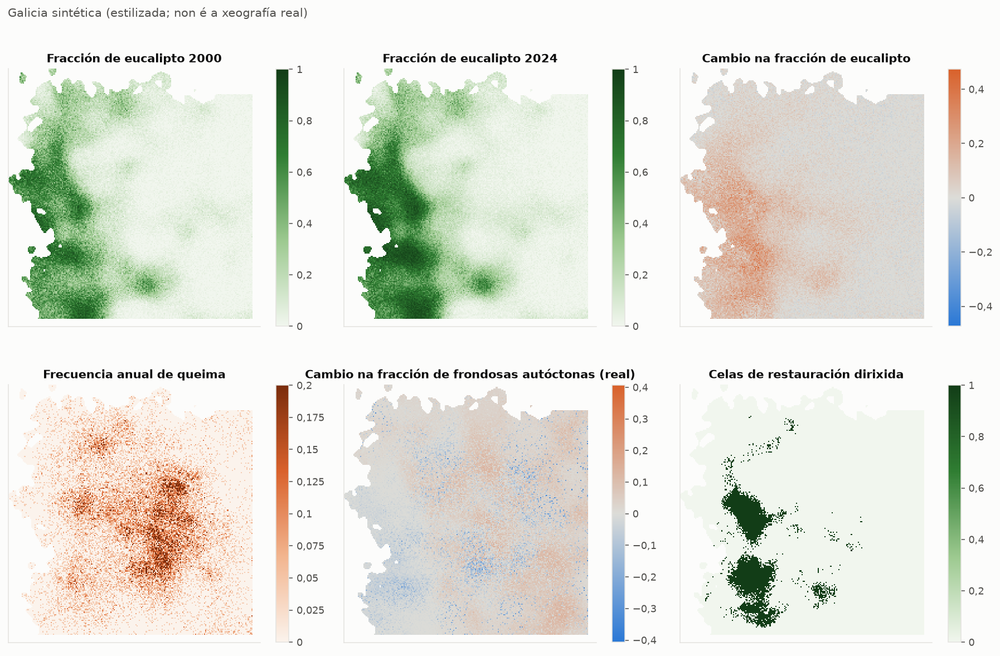
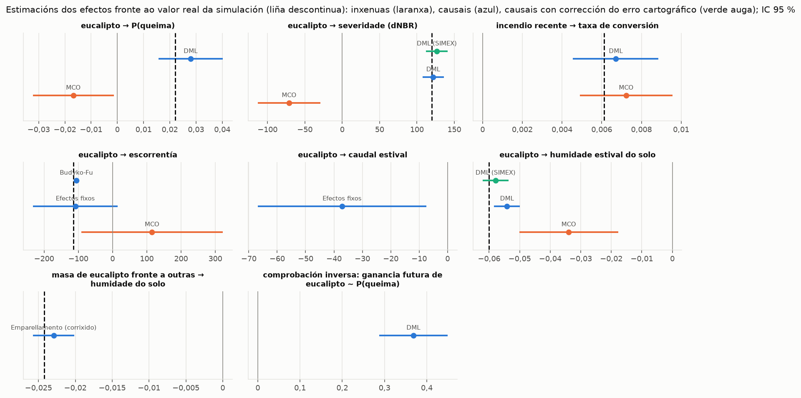
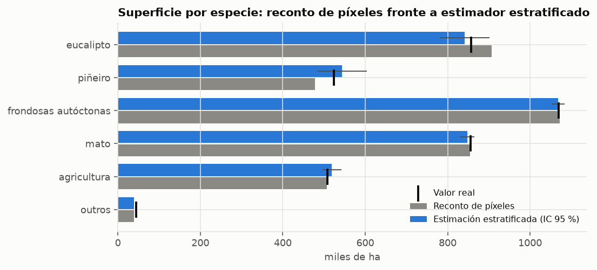
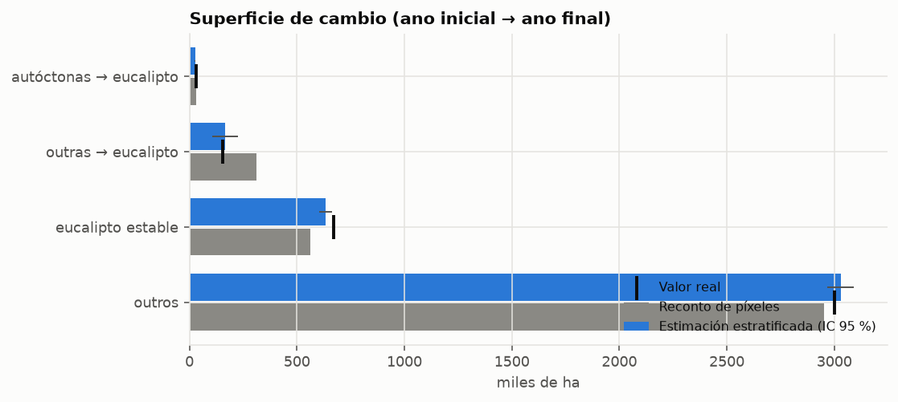
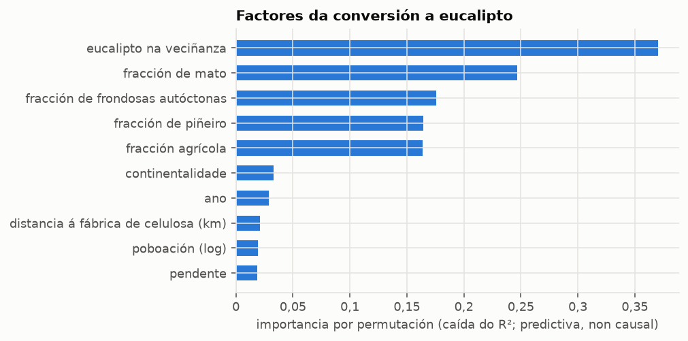
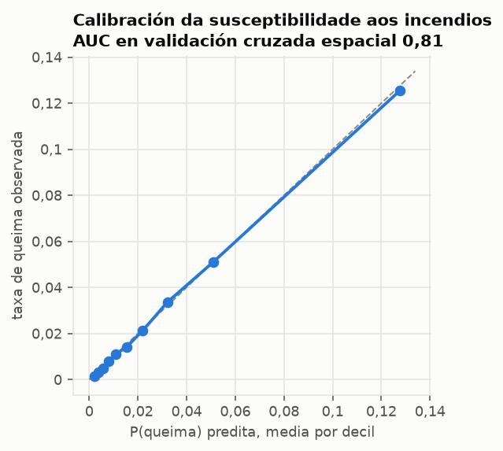
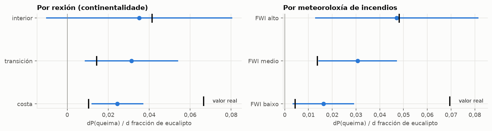
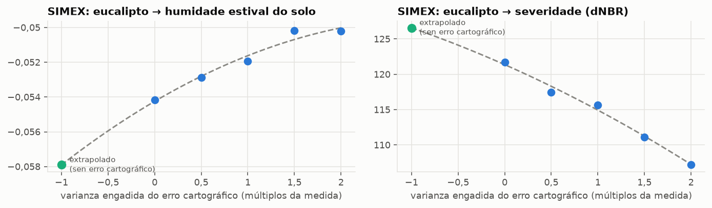
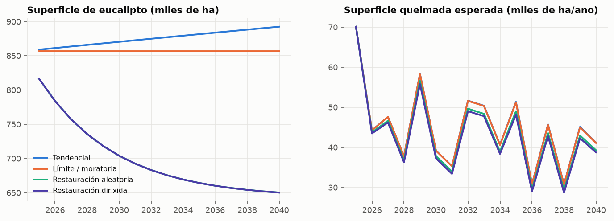

# Impacto do eucalipto en Galicia: informe da análise

> **DATOS SINTÉTICOS.** Todas as cifras deste informe proceden da paisaxe simulada en
> `data/synthetic.py`, cuxos efectos se fixaron a man. O informe demostra que os estimadores
> recuperan efectos coñecidos. Non di nada sobre a Galicia real.

Dominio: 38 581 celas de terra de 1 000 m, 2000–2024.
A superficie de eucalipto (valor real da simulación) pasou de 669 mil ha a
857 mil ha.

## 1. Estimacións dos efectos fronte ao valor real

As estimacións por MCO son as inxenuas: o que daría unha superposición de mapas ou unha regresión
bivariante. As causais eliminan a influencia do clima, do relevo, da presión humana e dos demais
tipos de cuberta.

| efecto | método | estimación | EE | valor real | o IC contén o valor real |
|---|---|---|---|---|---|
| eucalipto → P(queima) | MCO | -0,01678 | 0,007853 | 0,02209 | **non** |
| eucalipto → P(queima) | DML | 0,02791 | 0,00626 | 0,02209 | si |
| eucalipto → severidade (dNBR) | MCO | -71,13 | 21,38 | 120 | **non** |
| eucalipto → severidade (dNBR) | DML | 121,7 | 7,333 | 120 | si |
| incendio recente → taxa de conversión | MCO | 0,007231 | 0,001187 | 0,006126 | si |
| incendio recente → taxa de conversión | DML | 0,006706 | 0,001099 | 0,006126 | si |
| eucalipto → escorrentía | MCO | 115,2 | 105,3 | -113,9 | **non** |
| eucalipto → escorrentía | Efectos fixos | -108,8 | 63,11 | -113,9 | si |
| eucalipto → escorrentía | Budyko-Fu | -105,5 | – | -113,9 | – |
| eucalipto → caudal estival | Efectos fixos | -37,15 | 15,15 | – | – |
| eucalipto → humidade estival do solo | MCO | -0,03394 | 0,008257 | -0,06 | **non** |
| eucalipto → humidade estival do solo | DML | -0,05416 | 0,002163 | -0,06 | **non** |
| masa de eucalipto fronte a outras → humidade do solo | Emparellamento (corrixido) | -0,02293 | 0,001437 | -0,02424 | si |
| comprobación inversa: ganancia futura de eucalipto ~ P(queima) | DML | 0,3682 | 0,04131 | – | – |
| eucalipto → humidade estival do solo | DML (SIMEX) | -0,0579 | 0,002163 | -0,06 | si |
| eucalipto → severidade (dNBR) | DML (SIMEX) | 126,6 | 7,333 | 120 | si |

Varianza do erro cartográfico da fracción de eucalipto (segundo a mostra de referencia):
0,00042. O erro do clasificador no *tratamento* atenúa
todos os efectos cara a cero, e todas as fraccións de cuberta levan erro, tamén as que actúan como
control. As filas SIMEX corrixen isto: engaden erro cartográfico simulado, observan como se
degrada a estimación e extrapolan ata erro cero (sección 4b). Unha calibración de regresión máis
sinxela, cunha única varianza, corrixe en exceso, porque parte do ruído cartográfico do tratamento
se pode predicir a partir do ruído das outras fraccións.

Efecto de cada clase de cuberta sobre a probabilidade de incendio fronte á referencia
agricultura/outros. Úsase para valorar os escenarios. O valor real, na escala logit, é:
eucalipto 0,9, piñeiro 0,7, frondosas autóctonas
-0,6 e mato 1,1.

| cuberta | dP(queima)/dfracción | EE |
|---|---|---|
| eucalipto | 0,02791 | 0,00626 |
| piñeiro | 0,01779 | 0,007285 |
| frondosas autóctonas | -0,005582 | 0,005281 |
| mato | 0,03905 | 0,007613 |

## 2. Cartografía de especies e contabilidade da perda forestal

- Exactitude con validación cruzada por bloques espaciais **0,934**
  fronte a 0,939 con validación cruzada aleatoria (a diferenza é o
  optimismo dunha validación non espacial). Kappa 0,916.

| clase | superficie no mapa (ha) | superficie estimada (ha) | IC 95 % (± ha) | superficie real (ha) | exactitude do usuario | exactitude do produtor |
|---|---|---|---|---|---|---|
| eucalipto | 906 461 | 841 140 | 60 550 | 856 771 | 0,84 | 0,90523 |
| piñeiro | 478 276 | 543 597 | 60 550 | 523 491 | 0,83333 | 0,7332 |
| frondosas autóctonas | 1 071 780 | 1 068 019 | 15 495 | 1 069 250 | 0,99333 | 0,99683 |
| mato | 854 569 | 847 085 | 17 094 | 855 586 | 0,98667 | 0,99538 |
| agricultura | 507 533 | 519 305 | 23 048 | 508 098 | 0,98667 | 0,9643 |
| outros | 39 481 | 38 955 | 727,12 | 44 904 | 0,98667 | 1 |

Superficies de cambio. A diferenza entre dous mapas acumula os erros de ambos, e o estimador
estratificado corríxeo:

| clase | superficie no mapa (ha) | superficie estimada (ha) | IC 95 % (± ha) | superficie real (ha) |
|---|---|---|---|---|
| autóctonas → eucalipto | 32 215 | 27 490 | 1 830 | 30 921 |
| outras → eucalipto | 313 278 | 167 184 | 59 715 | 156 435 |
| eucalipto estable | 560 968 | 633 653 | 30 018 | 669 414 |
| outros | 2 951 639 | 3 029 772 | 61 924 | 3 001 329 |

Atribución da perda de cuberta arbórea (en fraccións de cela):

| causa | atribuída | real | proporción atribuída | proporción real |
|---|---|---|---|---|
| incendio | 4 713 | 4 456 | 0,1975 | 0,1867 |
| corta de rotación | 18 777 | 18 875 | 0,7868 | 0,7909 |
| conversión | 375,9 | 535,6 | 0,01575 | 0,02244 |

Modelo de factores da conversión: R² en validación cruzada espacial
0,129.

## 3. Incendios

Susceptibilidade: AUC en validación cruzada espacial **0,813**,
puntuación de Brier 0,0252 e taxa base 0,0275.

## 4. Auga

Parámetros da curva de Budyko (Fu). O valor real de w eucalipto é 1,2.

| parámetro | estimación | EE |
|---|---|---|
| w₀ | 2,04 | 0,04121 |
| w eucalipto | 1,089 | 0,06366 |
| w piñeiro | 0,4303 | 0,123 |
| w frondosas autóctonas | 0,2934 | 0,06725 |

Equilibrio do emparellamento. Proporción de celas tratadas descartadas por falta de
solapamento: 0,97.

| variable | DME antes | DME despois |
|---|---|---|
| altitude | -2,358 | 0,06848 |
| pendente | -0,3863 | 0,04156 |
| continentalidade | -1,984 | 0,1302 |
| precipitación media | 0,4187 | 0,04002 |
| ETP media | -1,161 | 0,1334 |
| temperatura estival | -0,01642 | 0,1247 |
| poboación (log) | 0,617 | -0,1291 |
| distancia á costa (km) | -0,9331 | 0,1918 |

## 4b. Robustez

**Onde aumenta máis o eucalipto o risco de incendio?** Efectos por grupos obtidos do mesmo axuste DML:

| grupo | estimación | EE | n | valor real |
|---|---|---|---|---|
| costa | 0,02451 | 0,00645 | 83 335 | 0,01037 |
| transición | 0,03135 | 0,01166 | 83 340 | 0,01442 |
| interior | 0,03514 | 0,02315 | 83 325 | 0,04149 |

| grupo | estimación | EE | n | valor real |
|---|---|---|---|---|
| FWI baixo | 0,01625 | 0,006641 | 83 334 | 0,00432 |
| FWI medio | 0,03071 | 0,008419 | 83 333 | 0,01372 |
| FWI alto | 0,04715 | 0,01753 | 83 333 | 0,04824 |

**Confusión non observada.** O *valor de robustez* (VR) da estimación é o R² parcial que necesitaría un factor de confusión non cartografado, tanto co tratamento como co resultado, para explicar toda a estimación. O VR do IC é o que leva o intervalo de confianza do 95 % ata cero. O nesgo máximo é o maior desprazamento que podería causar un factor de confusión desa intensidade.

| efecto | estimación | VR da estimación | VR do IC | nesgo máx. (R² = 0,02) | nesgo máx. (R² = 0,05) |
|---|---|---|---|---|---|
| eucalipto → P(queima) | 0,02791 | 0,0109 | 0,006121 | 0,05147 | 0,1307 |
| eucalipto → severidade (dNBR) | 121,7 | 0,1014 | 0,09002 | 22,97 | 58,33 |
| eucalipto → humidade estival do solo | -0,05416 | 0,1664 | 0,1545 | 0,006005 | 0,01525 |

**Agrupamento espacial.** Erro estándar do efecto sobre a aparición de incendios segundo o tamaño do bloque (km):

| bloque (km) | EE |
|---|---|
| 5 | 0,004816 |
| 10 | 0,005442 |
| 20 | 0,005495 |
| 40 | 0,006488 |
| 80 | 0,004013 |

**SIMEX.** Erro cartográfico en *todas* as fraccións de cuberta, extrapolado a cero:

## 5. Escenarios de política ata 2040

Contrastes no ano horizonte fronte ao escenario tendencial: o mundo simulado (valor real) xunto á
proxección feita cos efectos causais estimados (efectos DML por clase, ponderados polo risco, para
os incendios; a curva de Budyko axustada para a escorrentía). Os contrastes pequenos, como o do
límite, quedan dentro do ruído da simulación, así que o seu signo debe lerse con cautela.

| escenario | Δ eucalipto (ha) | Δ queimado simulado (ha/ano) | Δ queimado modelo (ha/ano) | Δ escorrentía simulada (mm) | Δ escorrentía modelo (mm) |
|---|---|---|---|---|---|
| Límite / moratoria | -35 873 | -102,3 | -94,73 | 0,674 | 0,6627 |
| Restauración dirixida | -242 401 | -2 437 | -4 572 | 3,646 | 3,924 |
| Restauración aleatoria | -242 347 | -1 899 | -2 866 | 3,877 | 4,116 |

## Siglas

| sigla | significado |
|---|---|
| AUC | área baixo a curva ROC |
| DME | diferenza de medias estandarizada |
| DML | aprendizaxe automática dobre (estimación causal con axustes cruzados) |
| dNBR | diferenza do índice normalizado de área queimada (severidade) |
| EE | erro estándar |
| ETP | evapotranspiración potencial |
| FWI | índice meteorolóxico de perigo de incendio |
| IC | intervalo de confianza |
| MCO | mínimos cadrados ordinarios (estimación inxenua) |
| SIMEX | extrapolación por simulación (corrección do erro de medida) |
| VR | valor de robustez |
